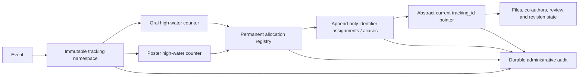

# Durable Abstract Tracking ID Design

**Date:** 2026-08-13

**Repositories:** `conference-api`, `Pris2026`

**Status:** Approved design
**Primary incident:** repeated `PRIS-2026-P022` unique-key failures on `POST /api/abstracts/submit`

## 1. Executive Summary

The abstract submission API currently derives the next tracking number from the number of rows that happen to exist for an event and presentation type. That algorithm is not an allocator. Deleting or moving any historical abstract can make the row count lower than an already-issued suffix. Once that happens, every failed transaction restores the same row count and produces the same conflicting ID forever.

This design replaces `COUNT(*)` allocation with four durable concepts:

1. an immutable tracking namespace for each event;
2. an atomic high-water counter per event and presentation type;
3. a permanent allocation registry containing every committed tracking ID ever issued or recovery-reserved;
4. an append-only assignment/alias chain connecting allocated IDs to an abstract.

`abstracts.tracking_id` remains the current canonical ID for compatibility with existing queries and API responses. It is no longer the historical source of truth by itself. The permanent allocation registry prevents reuse even when abstracts are archived, their authors are deleted, or only external evidence of an old ID survives.

The counter increment, abstract mutation, identifier registration, files, co-authors, and revision-state change occur in one PostgreSQL transaction. A failed transaction does not consume or expose a tracking number. A committed number is never reused.

### 1.1 Target relationship



The allocation registry answers “has this string ever been reserved?” The assignment chain answers “which abstract did it belong to, and what replaced it?” The abstract pointer answers “which ID is canonical now?” Keeping those questions separate removes the collision/FK ambiguity in the current model.

## 2. Incident Evidence and Root Cause

The supplied production log contains:

- 44 distinct `POST /api/abstracts/submit` requests;
- 44 PostgreSQL `23505` errors;
- the same detail every time: `PRIS-2026-P022 already exists`;
- 43 recorded 500 completions; one errored request (`req-2y`) has no completion line in the export;
- no successful submit response in the exported interval;
- failures spanning approximately 21 hours;
- one deployment/replica/host throughout the incident.

Each database error maps to a distinct incoming POST, so this is not one autonomous backend request spinning. The export cannot determine whether the fresh POSTs came from user clicks or client-side retry, and it contains no request body, user identity, or resolved event ID. The `PRIS-2026` prefix may have come from the event code or the current environment fallback; production audit must establish the actual owner rather than infer it from the string alone.

The current route performs this sequence in `src/routes/public/abstracts/submit.ts`:

1. insert an abstract with `tracking_id = NULL`;
2. count current rows for `(event_id, presentation_type)`;
3. use that count as the numeric suffix;
4. update the new row with the generated ID;
5. roll back the entire transaction when the global unique constraint rejects it.

If 21 poster rows remain while `P022` still exists, every request temporarily inserts row 22, generates `P022`, fails, and rolls back to 21 rows. The next request starts from exactly the same state.

Two existing behaviors can create this mismatch:

- deleting a member hard-deletes all of that member's abstracts;
- resubmission may change `presentation_type` while retaining the old `P`/`O` ID.

Direct database deletes, imports, restores, and legacy event-code changes can create the same condition. Concurrency is a separate latent bug because the current count query has no serialization, but a transient race alone does not explain the same collision for 21 hours.

## 3. Goals

### 3.1 Correctness

- Tracking IDs are globally unique.
- Each event has independent oral and poster number series.
- A successfully issued number is never reused.
- Deletion, archival, presentation-type changes, restore, or row-count changes never reduce a counter.
- Gaps are valid and expected.
- Failed transactions do not consume a number because the number was never committed or exposed.
- Concurrent submissions cannot receive the same number.
- A presentation-type change receives a fresh ID from the destination type's current high-water counter.
- Every previous ID remains a permanent alias resolving to the same abstract.

### 3.2 Compatibility

- Preserve the existing ID format: `<prefix>-P###` and `<prefix>-O###`.
- Preserve `abstracts.tracking_id` as the current ID.
- Preserve existing public v1 routes and their required success fields.
- Add response fields rather than replacing existing response envelopes.
- Continue accepting the current multipart request fields.
- Do not require clients to generate or submit tracking IDs.

### 3.3 Operations

- Rehearse migration against an anonymized production snapshot.
- Support an off-hours rollout without a planned endpoint shutdown.
- Fail closed if allocator state is missing or inconsistent.
- Provide deterministic preflight, verification, rollback, and monitoring procedures.
- Preserve identifiers across backup/restore and disaster recovery.

### 3.4 Data lifecycle

- Abstracts that have received an ID are archived rather than hard-deleted.
- Deleting/anonymizing a member unlinks the author but preserves the abstract and all identifiers.
- Events with issued identifiers cannot be hard-deleted.
- Event-code edits do not mutate an established tracking prefix.
- Legacy anomalies require an explicit reviewed decision; migrations do not silently renumber them.

## 4. Non-goals

- Renumbering valid historical IDs to make sequences gap-free.
- Reusing numbers from deleted, archived, rejected, or withdrawn abstracts.
- Making IDs globally consecutive across all events and presentation types.
- Replacing the current authentication or authorization model.
- Redesigning the entire abstract-review workflow.
- Building the external backoffice UI; its repository is not in this workspace.
- Introducing GraphQL.
- Introducing a full API v2 solely for this incident.
- Adding request idempotency in this delivery. Idempotency remains a recommended follow-up, but allocator correctness does not depend on it.
- Automatically replaying the 44 failed production submissions. Their payloads are not present in the log.

## 5. Approved Product Decisions

These decisions were explicitly confirmed during design discussion:

1. Tracking sequences may contain gaps.
2. IDs increase monotonically and never reuse a committed number.
3. Resubmit may change `poster` to `oral` or `oral` to `poster`.
4. A type change allocates a fresh ID from the destination type's latest counter.
5. The previous ID remains a permanent searchable alias.
6. Changing back to a previous type allocates another fresh ID; an old alias is never reactivated.
7. The tracking prefix is separate from mutable `eventCode` and freezes on first issuance.
8. Abstracts with issued IDs are archived rather than hard-deleted.
9. Member deletion/anonymization preserves abstract history and unlinks the author.
10. Events with issued identifiers cannot be hard-deleted.
11. A number is considered issued only if its enclosing database transaction commits.
12. Legacy mismatches, missing IDs, and malformed IDs require a reviewed remediation manifest.
13. Production migration is rehearsed on an anonymized production-like snapshot.
14. Production deploy occurs off hours; the endpoint remains nominally open.

## 6. Alternatives Considered

### 6.1 Atomic per-namespace/type counter — selected

A row keyed by event namespace and presentation type stores the last committed number. PostgreSQL row locking serializes concurrent allocation. The increment participates in the caller transaction.

Advantages:

- matches existing per-event/per-type numbering;
- transactional rollback matches the approved rule;
- cheap constant-time allocation;
- straightforward monitoring and repair;
- no dynamic database objects per event.

Trade-off:

- submissions for the same event/type serialize briefly on one row. This is negligible at conference volume.

### 6.2 PostgreSQL sequence

`nextval()` is concurrency-safe and simple, but is intentionally non-transactional. A rollback burns a number. One global sequence also interleaves all events and types, while a sequence per event/type creates dynamic-DDL lifecycle complexity.

This does not match the approved transaction semantics and is rejected.

### 6.3 `MAX(suffix) + 1` with advisory locks

An advisory lock can serialize parsing and scanning historical IDs. It avoids a counter table but makes correctness depend on every writer taking the same implicit lock. It also scans/parses IDs on every request and loses high-water information if the greatest historical row disappears.

This is rejected as less observable and more fragile.

### 6.4 Random or opaque identifiers

UUIDs or random codes would remove numeric allocation but break the established human-readable business format. This is rejected for this system.

## 7. Domain Invariants

The database and services must preserve all of the following:

1. `tracking_id` is globally unique across current IDs and aliases.
2. A namespace prefix is case-insensitively unique.
3. A namespace belongs to exactly one event.
4. A namespace prefix and padding width may change only before the first committed issuance.
5. There is one counter per `(event_id, presentation_type)`.
6. `last_issued_number` never decreases.
7. A native structured allocation has exactly one positive numeric sequence.
8. `(event_id, presentation_type, sequence_number)` is unique for structured allocations.
9. Every identifier assignment belongs to exactly one abstract forever; an unassigned recovery tombstone remains an allocation only.
10. An old assigned identifier has at most one direct successor, producing a linear history rather than a branch.
11. The abstract's current ID belongs to that same abstract, event, and current presentation type.
12. An archived abstract retains its current ID and all prior identifiers.
13. A member or event mutation cannot cascade-delete identifier history.
14. No response or email may expose a newly allocated ID before commit.
15. After `0028`, Release A never falls back to `COUNT(*)`, in-memory counters, or direct string mutation. The temporary bridge protects only pre-A binaries during rolling deployment; it is disabled after all pre-A writers drain and removed in Release B.

## 8. Tracking ID Format

The canonical native format is:

```text
<immutable-prefix>-<type-marker><number>
```

Examples:

```text
PRIS-2026-P023
PRIS-2026-O016
```

Rules:

- prefix: 1–50 characters;
- new native prefixes must match `^[A-Z0-9]+(?:-[A-Z0-9]+)*$`, making rendered IDs safe and unambiguous in URLs, exports, and filenames;
- prefix is trimmed but never silently truncated;
- marker: `P` for `poster`, `O` for `oral`;
- number: positive bigint;
- padding width defaults to 3 and is a minimum width, not a maximum;
- number 1000 with width 3 renders as `1000`, never `100`;
- total ID length must not exceed 80 characters.

Parsing uses the final marker/suffix so prefixes may themselves contain hyphens:

```regex
^(.+)-([OP])([0-9]+)$
```

Legacy malformed/unsafe IDs are preserved as opaque allocations and aliases after manual review. They are never candidates for native allocation and are resolved through a query parameter rather than embedded in a URL path segment.

## 9. Data Model

### 9.1 `abstract_tracking_namespaces`

One mutable-before-use, immutable-after-use namespace per event.

| Column | Type | Rules |
|---|---|---|
| `event_id` | integer | primary key, FK to `events`, `ON DELETE RESTRICT` |
| `prefix` | varchar(50) | non-empty, case-insensitively unique |
| `padding_width` | smallint | default 3, allowed 1–12 |
| `locked_at` | timestamptz nullable | set by the first committed issuance |
| `created_at` | timestamptz | default now |
| `updated_at` | timestamptz | default now |

The API may delete an unlocked namespace immediately before deleting an unused event. A locked namespace cannot be deleted.

Namespace mutations set `updated_at` explicitly in the guarded database function; integration tests prove it changes on each successful configuration/lock transition.

### 9.2 `abstract_tracking_counters`

| Column | Type | Rules |
|---|---|---|
| `event_id` | integer | FK to namespace/event, `ON DELETE RESTRICT` |
| `presentation_type` | existing enum | `oral` or `poster` |
| `last_issued_number` | bigint | non-negative and never decreased |
| `updated_at` | timestamptz | default now |

Primary key:

```text
(event_id, presentation_type)
```

The row is the serialization point for one number series.

Both oral and poster rows are created atomically with the namespace. Runtime allocation treats a missing row as an invariant/configuration failure; it does not silently create or reset a counter. A monotonicity trigger rejects key changes, decreases, and ordinary DELETE. The only delete exception is a narrow `delete_unused_tracking_namespace` function that locks the event/namespace, proves it is unlocked, both counters are zero, and no allocation/assignment/abstract history exists, then removes the zero counters and namespace before deletion of a truly unused event. The API role cannot mutate the table directly and executes only guarded functions.

The allocator function sets counter `updated_at = clock_timestamp()` on every successful advance.

### 9.3 `abstract_tracking_allocations`

This is the permanent global no-reuse registry. It reserves a tracking string independently from an abstract, allowing the allocator to claim a candidate atomically before the abstract row exists and allowing disaster-recovery tombstones for an externally evidenced ID whose original abstract is no longer present.

| Column | Type | Rules |
|---|---|---|
| `tracking_id` | varchar(80) | primary key; globally reserves the string |
| `event_id` | integer nullable | non-null FK for native/known legacy IDs; nullable only for an unscoped recovery tombstone |
| `identifier_origin` | varchar(24) | `native`, `legacy_structured`, `legacy_opaque`, or `recovery_tombstone` |
| `presentation_type` | enum nullable | non-null for structured rows |
| `sequence_number` | bigint nullable | positive for structured rows |
| `allocated_at` | timestamptz | committed reservation time |
| `metadata` | jsonb | safe migration/recovery evidence only; no PII |

Constraints and enforcement:

- primary key on `tracking_id`;
- unique `(event_id,presentation_type,sequence_number)` where sequence is not null;
- origin check: native/structured rows require event, type, and positive sequence; opaque/tombstone rows do not pretend to be native;
- native INSERT validation renders the string from the immutable namespace and requires an exact match;
- assignment append validation requires a structured allocation's event/type to equal the assignment event/type; a known-event opaque allocation must match its event; a `recovery_tombstone` is reservation-only and cannot be assigned or returned by abstract lookup;
- a deferred constraint trigger requires every committed allocation except `recovery_tombstone` to have exactly one identifier assignment by commit;
- append-only trigger rejects UPDATE and DELETE;
- direct API DML is revoked; a narrow allocator function owns native INSERTs.

The recovery-tombstone importer is migrator-only, takes the exclusive cutover advisory lock, and runs only after `history_ready=true` with the bridge disabled and all pre-A writers drained. It never runs while any pre-A bridge allocation path can write. Import and a legacy submit therefore cannot race or reserve the same string in separate tables.

### 9.4 `abstract_tracking_identifiers`

This append-only table assigns a permanently reserved ID to one abstract and records the alias chain.

| Column | Type | Rules |
|---|---|---|
| `tracking_id` | varchar(80) | primary key, FK to allocation, delete restricted |
| `abstract_id` | integer | non-null FK to `abstracts`, delete restricted |
| `event_id` | integer | event of the assigned abstract |
| `presentation_type_at_assignment` | enum | abstract type represented by this assignment; native rows must match the allocation type |
| `assignment_reason` | varchar(40) | allowed values listed below |
| `previous_tracking_id` | varchar(80) nullable | previous ID in the same abstract's linear chain |
| `assigned_at` | timestamptz | committed assignment time |
| `metadata` | jsonb | safe migration/audit metadata only; no PII |

Allowed assignment reasons:

```text
initial_submission
presentation_type_change
legacy_import
migration_assignment
migration_normalization
admin_correction
```

Constraints and enforcement:

- primary key on `tracking_id`;
- unique `(abstract_id,tracking_id)` for same-abstract predecessor references;
- unique `(abstract_id,event_id,presentation_type_at_assignment,tracking_id)` as the exact target of the delayed current-ID FK;
- unique root per abstract where `previous_tracking_id IS NULL`;
- unique `previous_tracking_id` where non-null, preventing branches;
- check preventing self-reference;
- reason/predecessor check: initial/import/assignment rows are roots; rotation/normalization/correction rows require a predecessor;
- composite FK `(abstract_id,event_id)` to `abstracts(id,event_id)`;
- composite FK `(abstract_id,previous_tracking_id)` to the same abstract's preceding identifier;
- append function/trigger, called while the abstract row is locked, requires the predecessor to be the current tail and rejects cycles or disconnected chains;
- append-only trigger rejects UPDATE and DELETE; direct API UPDATE/DELETE is revoked.

The table does not need `is_current`. Currentness is determined by comparing the assignment with `abstracts.tracking_id`, avoiding two independent current flags.

### 9.5 Changes to `abstracts`

Add or change:

| Column | Change |
|---|---|
| `tracking_id` | widen from varchar(20) to varchar(80); eventually `NOT NULL` |
| `archived_at` | nullable timestamptz |
| `archived_by` | nullable FK to backoffice user |
| `archive_reason` | nullable varchar(40) with allowed-value check |
| `archive_note` | nullable text with bounded API validation |
| `updated_at` | non-null timestamptz default now |

Add a unique constraint on `(id, event_id)` so identifier history can prove event ownership.

Every service/route that updates an abstract must include `updated_at = clock_timestamp()` in the same statement. Because many existing writers touch this table, migration `0028` also installs a small `BEFORE UPDATE` trigger that sets `updated_at` whenever a row changes, making the audit timestamp reliable even if a future writer omits it. Tests verify both direct SQL and service mutations advance the value.

After legacy reconciliation, add a deferred composite foreign key:

```text
abstracts(id, event_id, presentation_type, tracking_id)
    -> abstract_tracking_identifiers(
         abstract_id,
         event_id,
         presentation_type_at_assignment,
         tracking_id
       )
```

It is `DEFERRABLE INITIALLY DEFERRED`, allowing the abstract and assignment row to be inserted or rotated in either order inside one transaction while preventing an inconsistent commit.

### 9.6 Runtime cutover state

`abstract_tracking_runtime` contains one singleton row:

| Column | Type | Purpose |
|---|---|---|
| `singleton` | boolean PK/check true | exactly one row |
| `allocator_enabled` | boolean | durable allocator available to Release A |
| `allocator_version` | smallint | operational version |
| `history_ready` | boolean | legacy roots/aliases reconciled; enables type rotation and hardening |
| `legacy_bridge_enabled` | boolean | compatibility trigger protects pre-A writes during rolling deploy |
| `abstract_writes_paused` | boolean | emergency submit/resubmit kill switch, default false |
| `write_pause_reason` | varchar(64) nullable | required stable operator reason while paused |
| `updated_at` | timestamptz | audit/health |

The bridge fields coordinate a safe mixed-release rollout. Migration `0028` consumes reviewed namespaces and historical floors, creates both counters at those floors, enables the durable allocator for Release A, leaves `history_ready=false`, and installs temporary database guards for pre-A binaries. When old code assigns a previously-null tracking ID, the bridge locks the relevant counter and rejects any suffix `<= last_issued_number`; a greater valid candidate atomically advances the counter and inserts its allocation/root assignment/audit. It rejects legacy type changes that would create a marker/type mismatch and blocks hard DELETE of abstracts/events while tracking state exists. Therefore a hard-deleted ID below the reviewed floor cannot be reused during rolling deployment, while old initial submit remains nominally available for candidates above the floor. Release A uses the durable allocator immediately; it never calls COUNT. Type-changing resubmit and tracking-shape mutations requiring complete history return `503 TRACKING_HISTORY_INITIALIZING` until online backfill and reconciliation set `history_ready=true`. After every pre-A writer drains, the bridge guards are disabled under the exclusive advisory lock.

The legacy branch is removed after the hardening release, but the independently controlled write-pause fields remain as an emergency correctness control. A migration-owned operator function is the only writer: it first acquires the exclusive cutover advisory transaction lock `(20260813, 1)`, then locks the singleton row, requires a reason when pausing, clears the reason when resuming, and appends `abstract_tracking.write_pause_changed` in the same transaction. This drains database writes that have already acquired their shared transaction lock and makes database commit eligibility a precise boundary. Submit/resubmit performs an early best-effort check before external upload and checks again authoritatively inside the transaction. A race may upload a file between those checks; if the authoritative check rejects it, the existing compensating cleanup must remove that upload and emit/alert on cleanup failure. While paused, new database mutations return `503 ABSTRACT_WRITES_PAUSED`; reads, health, identifier lookup, and administrative repair stay available. Readiness remains 200 with an explicit low-cardinality `abstractWrites: "paused"` component so container orchestration does not restart a deliberately paused healthy API.

### 9.7 Durable administrative audit

`abstract_tracking_audit_events` is append-only and records prefix configuration/lock, allocation/rotation, archive/restore, member unlink, migration normalization, and administrative correction.

| Column | Type | Rules |
|---|---|---|
| `id` | bigint identity | primary key |
| `event_type` | varchar(64) | checked stable event name |
| `event_id` | integer nullable | safe resource reference |
| `abstract_id` | integer nullable | safe resource reference; no delete cascade |
| `actor_type` | varchar(24) | `system`, `member`, `backoffice`, or `migration` |
| `actor_id` | integer nullable | set when an authenticated actor survives retention policy |
| `request_id` | varchar(128) nullable | correlation only, never a metric label |
| `reason_code` | varchar(64) nullable | stable non-PII reason |
| `before_state` | jsonb nullable | identifier/type/archive metadata allowlist only |
| `after_state` | jsonb nullable | identifier/type/archive metadata allowlist only |
| `created_at` | timestamptz | default now |

It never stores titles, abstract text, emails, phones, file URLs, multipart content, raw database errors, or raw `archive_note`; archive audit stores only reason/state, timestamps, actor reference, and `notePresent`. Append-only trigger and non-owner runtime privileges reject UPDATE/DELETE. `actor_id` is an internal pseudonymous reference retained under the same operational/legal retention policy as issued identifiers; this delivery does not mutate it. A future privacy-erasure design must use a separate replacement/tombstone audit record rather than rewriting history.

Operational application logs remain useful telemetry, but they are not the durable administrative audit record.

Allowed durable `event_type` values are fixed and schema-tested:

```text
abstract_tracking.issued
abstract_tracking.rotated
abstract_tracking.prefix_configured
abstract_tracking.prefix_locked
abstract_tracking.admin_corrected
abstract_tracking.recovery_tombstone_imported
abstract_tracking.migration_imported
abstract_tracking.migration_normalized
abstract_tracking.floor_applied
abstract_tracking.cutover_completed
abstract_tracking.legacy_bridge_changed
abstract_tracking.hardening_completed
abstract_tracking.write_pause_changed
abstract.archived
abstract.restored
abstract.member_unlinked
event.archived
event.restored
```

Adding a new event name requires an additive migration plus schema/function contract test; callers cannot submit arbitrary event strings to the definer function.

### 9.8 Archive metadata on events

Add `archived_at`, `archived_by`, and `archive_reason` to `events`, or model equivalent audit records. Archived events retain namespaces, counters, abstracts, files, and identifier history. New submissions are rejected.

## 10. Namespace Lifecycle

### 10.1 Event creation

- Backoffice may provide `abstractTrackingPrefix` and `trackingPaddingWidth`.
- If omitted, prefix defaults to the reviewed `eventCode` value.
- For backward compatibility, if an omitted-prefix `eventCode` does not satisfy the native prefix grammar, event creation still succeeds but leaves the tracking namespace unconfigured and returns additive `trackingNamespaceConfigured: false`. Backoffice must configure an explicit valid prefix before abstract submission opens; the server never sanitizes/truncates silently.
- Prefix uniqueness and length are validated before creating the namespace.
- When configured, the namespace and both counters are created atomically and begin unlocked.

### 10.2 Before first issuance

- Backoffice may update prefix/padding through the dedicated namespace resource.
- Updating `eventCode` does not automatically update the prefix.
- Setting the same prefix/padding is idempotent.

### 10.3 First committed issuance

- Allocator locks the namespace row.
- It sets `locked_at` inside the same transaction as the identifier.
- A rollback also rolls back the lock timestamp.

### 10.4 After first issuance

- Prefix and padding are immutable.
- A different update returns `409 TRACKING_PREFIX_LOCKED`.
- Event-code edits remain allowed but do not alter tracking IDs.
- Event hard deletion returns `409 EVENT_HAS_TRACKING_HISTORY`.

## 11. Allocation Algorithm

### 11.1 Lock order

Every write follows one lock order:

```text
cutover advisory lock
  -> event row
  -> existing abstract row (resubmit only)
  -> active category row
  -> namespace row
  -> counter row
  -> allocation insert
  -> abstract row
  -> identifier assignment/files/co-authors/revision rows
```

No code may acquire these locks in reverse order. Resubmit therefore resolves the owned abstract ID/event without locking, locks the event row, then locks and re-reads the abstract by `(id,event_id,owner)` before making any state decision.

All participating write transactions explicitly use PostgreSQL `READ COMMITTED`. Immediately after acquiring the shared advisory lock, they read `abstract_tracking_runtime FOR SHARE` before any domain lock or mutation. Operator bridge/history/pause/cutover transactions update that singleton while holding the exclusive advisory lock. Startup/readiness asserts `default_transaction_isolation = read committed`; another default is unsupported/unready. This prevents a waiter from retaining a pre-boundary REPEATABLE READ snapshot; an unexpected serialization/deadlock error retries the complete transaction only within the documented bound.

### 11.2 Atomic allocator

Within the caller transaction:

1. Acquire the shared transaction-scoped cutover advisory lock.
2. Read runtime allocator mode.
3. Select the event row `FOR UPDATE`; recheck archive status, submission window/policy, and event identity.
4. If the operation uses a category, its caller locks and rechecks that category after the event/abstract locks and before invoking the allocator.
5. Select the event namespace `FOR UPDATE` and verify both pre-created type counters exist.
6. Reject missing, archived, or invalid namespace state.
7. Select the requested type counter `FOR UPDATE`.
8. Read the maximum structured allocation already registered for the same event/type.
9. Compute:

   ```text
   candidate = max(counter.last_issued_number, registered_max) + 1
   ```

10. Reject bigint overflow.
11. Format the ID using minimum-width padding.
12. Insert the candidate into `abstract_tracking_allocations` with `ON CONFLICT (tracking_id) DO NOTHING RETURNING ...`.
13. If no row returns, advance the candidate and repeat the bounded insert while retaining the locks.
14. Advance the counter to the successfully reserved candidate.
15. Set namespace `locked_at` if this is its first successful allocation.
16. Return the transaction-scoped reservation to the enclosing service.

Steps 3 and 5–16 live in a narrow migration-owned `SECURITY DEFINER` PostgreSQL function; the category lock in step 4 belongs to the submission/resubmission service because category is not an allocator input. The function schema-qualifies every object and uses a locked search path with `pg_catalog` first and `pg_temp` last; runtime/PUBLIC cannot `CREATE` in referenced schemas. The API role has EXECUTE but not direct counter/allocation DML. The function still participates in the caller's ordinary transaction—there is no autonomous commit. Event archive/restore/delete takes the same advisory lock then event row lock before namespace/counters, so it cannot cross a submit after the allocator's active-state check. The allocation maximum is a defense against a restored or manually stale counter, not a replacement for the counter.

### 11.3 Collision defense

The cutover must reserve every historical non-null ID. Nevertheless, an opaque legacy string could equal a future formatted candidate.

- Reserve through `INSERT ... ON CONFLICT DO NOTHING RETURNING` while holding the event/type counter lock.
- If that exact ID already exists, advance the already-locked candidate and try the next value.
- Allow at most three candidate checks in one transaction.
- Emit a critical structured event for every skipped collision.
- After three collisions, fail with `503 TRACKING_INVARIANT_VIOLATION`.
- The later abstract and assignment inserts still retain their unique/FK constraints as defense in depth.
- If a late unique violation nevertheless occurs, abort that transaction. The service may retry the complete transaction once, then fail closed; it must never continue in an already-aborted PostgreSQL transaction.
- Never expose raw PostgreSQL `23505` details.

## 12. Initial Submission Flow

The external file upload currently occurs before the database transaction. That behavior may remain initially, provided cleanup is retained.

Database transaction:

1. Acquire the shared cutover lock, lock the event, and recheck archive/submission-window state.
2. Lock/recheck the selected category by `(id,event_id,is_active)` so an upload-time category change cannot cross the validation.
3. Allocate the final tracking ID for the submitted type.
4. Insert `abstracts` once with its final non-null `tracking_id`.
5. Insert its `initial_submission` identifier assignment row referencing the reserved allocation.
6. Insert abstract files.
7. Insert co-authors.
8. Commit.

After commit only:

- return HTTP 201;
- log issuance success;
- send/enqueue author and co-author emails.

On failure:

- the counter, allocation, assignment, abstract, audit, files, and co-authors roll back together;
- uploaded Drive files are cleaned up;
- the client receives a controlled error with `requestId`.

## 13. Resubmit and Presentation-Type Change

All authoritative checks are repeated under an abstract row lock inside the transaction.

### 13.1 Same type

Example: poster -> poster.

- Keep current ID.
- Do not increment any counter.
- Do not add an identifier history row.
- Update content, category, files, co-authors, and status.

### 13.2 Different type

Example:

```text
current: PRIS-2026-P022
destination oral high-water: O015
new current: PRIS-2026-O016
```

Transaction:

1. Resolve owned abstract/event identity without a row lock, acquire the shared cutover lock, then lock the event `FOR UPDATE`.
2. Lock and re-read the owned abstract by `(id,event_id,user_id)` `FOR UPDATE`.
3. Recheck `status = revision`, ownership, archive state, event policy, and lock/recheck the selected active category.
4. Allocate the destination type's next ID while retaining those locks.
5. Insert a new identifier assignment row with:
   - `assignment_reason = presentation_type_change`;
   - `previous_tracking_id = PRIS-2026-P022`.
6. Update `abstracts.presentation_type` and `abstracts.tracking_id` together.
7. Replace files/co-authors and close the open revision request.
8. Commit.

After commit, both IDs resolve to the same abstract. The old ID is an alias. If the abstract later changes back to poster, it receives a new poster number and does not reactivate `P022`.

### 13.3 Concurrent resubmits

The first request locks the abstract and commits it back to `pending`. A concurrent second request then sees the new status and returns a state conflict without allocating a second ID.

## 14. Identifier Resolution and Search

Resolution begins at `abstract_tracking_identifiers.tracking_id`, not only `abstracts.tracking_id`.

Given an input ID:

- find the allocation by primary key and its assignment, if any;
- join the assignment to its abstract;
- compare requested ID with `abstracts.tracking_id`;
- return `canonical` if equal or `alias` otherwise;
- apply the same event/category/reviewer authorization as direct abstract access;
- return 404 for a missing/unassigned recovery tombstone or unauthorized identifier to avoid enumeration.

Broad backoffice search includes current ID and aliases. Exact identifier lookup uses equality and never `%` matching.

## 15. Archive and Deletion Semantics

### 15.1 Abstract archival

Archival is orthogonal to review status.

- Set archive metadata; do not change or release identifiers.
- Public/user active queries exclude archived rows.
- Backoffice defaults to active rows and can explicitly include archived rows.
- Confirmation, revision, review, resend, and manual email operations reject or skip archived rows.
- Restore is permitted only when policy prerequisites are satisfied.

Abstract archive reasons are exactly:

```text
manual
withdrawn
member_deleted
legacy_anomaly
duplicate_submission
```

Event archive reasons are exactly `completed`, `cancelled`, `superseded`, and `manual`. Archive request `note` is optional, trimmed, 1–1000 characters when present, stored as null when absent/blank, and never included in public responses/logs. Adding a reason is an additive schema/API-contract change.

For both abstract and event rows, a database consistency check enforces: active (`archived_at IS NULL`) means reason, note, and actor are null; archived means an allowed non-null reason. `archived_by` may later become null through its explicit `ON DELETE SET NULL` actor lifecycle; the durable append-only audit retains pseudonymous actor provenance, so actor nullability does not redefine the archive as a system action. `member_deleted` is service-only and `legacy_anomaly` is migration/admin-correction-only; ordinary archive endpoint callers may choose only `manual`, `withdrawn`, or `duplicate_submission` for abstracts.

### 15.2 Member deletion or anonymization

Before deleting/anonymizing a user:

1. resolve affected event/abstract IDs without row locks, acquire the shared cutover lock, lock distinct event rows in ascending ID order, then lock affected abstract rows in ascending ID order;
2. recheck ownership and archive each active abstract with `member_deleted`;
3. set `abstracts.user_id = NULL`;
4. preserve identifiers, files, co-authors, reviews, revision history, and counters;
5. invalidate active confirmation tokens;
6. continue the existing user/order/registration cleanup only where allowed.

A `member_deleted` abstract cannot be restored until a separately audited author re-link occurs.

### 15.3 Event deletion

- An unused event with an unlocked namespace and no dependent data may still be deleted after explicitly deleting its unused namespace.
- Any event with a locked namespace, counter greater than zero, identifier, or abstract history cannot be hard-deleted.
- Operators archive/complete it instead.

## 16. REST API Design

### 16.1 Compatibility policy

The existing API is not consistently versioned. This delivery therefore:

- retains existing v1 URLs;
- retains required success keys and the human-readable string `error` field;
- adds stable `code`, `requestId`, and optional metadata;
- uses resource-oriented URLs for new resources;
- explicitly treats type-changing resubmit as an intentional, approved semantic breaking change: the existing route now rotates the current ID, release notes identify this behavior, and all known clients/integrations receive contract fixtures before rollout;
- deploys the matching `Pris2026` client in the same release window.

This is wire-compatible but not fully behavior-compatible. Unknown external consumers are a rollout risk and must be checked through access logs/integration ownership before enabling the allocator. If an uncoordinated consumer exists, expose rotation behind an explicit opt-in/versioned resubmit contract and keep its current behavior until migrated.

A future API v2 may remodel submit as `POST /api/v2/events/{eventCode}/abstracts` and resubmit as a revision resource, but that is not necessary to repair allocator correctness.

### 16.2 Standard v1 error envelope

```json
{
  "success": false,
  "code": "TRACKING_ALLOCATOR_UNAVAILABLE",
  "error": "Abstract submission could not be completed. Check your submissions before trying again, or contact support with the request ID.",
  "details": {},
  "requestId": "req-abc"
}
```

Rules:

- `code` is stable and suitable for client branching;
- `error` remains a string for compatibility;
- `details` is optional and contains no sensitive data;
- every error response includes `X-Request-Id` matching the body;
- database messages, SQL, titles, author emails, and file URLs are never exposed.

### 16.3 Submit

Existing endpoint:

```http
POST /api/abstracts/submit
Content-Type: multipart/form-data
Authorization: Bearer ...
```

Success remains HTTP 201:

```json
{
  "success": true,
  "abstract": {
    "id": 412,
    "trackingId": "PRIS-2026-P023",
    "presentationType": "poster",
    "title": "...",
    "status": "pending",
    "fullPaperUrl": "...",
    "files": [],
    "submittedAt": "2026-08-13T12:00:00.000Z",
    "trackingAliases": []
  },
  "identifierChange": {
    "changed": false,
    "previousTrackingId": null,
    "trackingId": "PRIS-2026-P023"
  },
  "message": "Abstract submitted successfully",
  "requestId": "req-abc"
}
```

Do not emit `Location` in this delivery because no authenticated canonical GET resource currently exists for that URI.

### 16.4 Resubmit

Existing endpoint:

```http
PATCH /api/abstracts/user/{id}/resubmit
```

Type-changing success remains HTTP 200:

The representation below is complete for the touched route: it preserves existing `title`, `fullPaperUrl`, `files`, and `resubmittedAt` fields in addition to the new identifier metadata.

```json
{
  "success": true,
  "abstract": {
    "id": 412,
    "trackingId": "PRIS-2026-O016",
    "title": "Example abstract",
    "presentationType": "oral",
    "status": "pending",
    "fullPaperUrl": "https://drive.example/file",
    "files": [],
    "resubmittedAt": "2026-08-14T01:00:00.000Z",
    "trackingAliases": ["PRIS-2026-P022"]
  },
  "identifierChange": {
    "changed": true,
    "reason": "PRESENTATION_TYPE_CHANGED",
    "previousTrackingId": "PRIS-2026-P022",
    "trackingId": "PRIS-2026-O016"
  },
  "message": "Abstract resubmitted successfully",
  "requestId": "req-def"
}
```

Same-type resubmit returns `changed: false` and preserves the ID.

### 16.5 Backoffice identifier resource

```http
GET /api/backoffice/abstract-identifiers/resolve?trackingId=PRIS-2026-P022
```

The query form intentionally supports grandfathered opaque IDs containing characters that are unsafe or ambiguous in a path segment. `trackingId` is required, exact, case-sensitive, and limited to 80 characters after URL decoding.

Response:

```json
{
  "identifier": {
    "requested": "PRIS-2026-P022",
    "match": "alias",
    "canonicalTrackingId": "PRIS-2026-O016",
    "issuedAt": "2026-06-01T00:00:00.000Z",
    "assignmentReason": "INITIAL_SUBMISSION",
    "replacement": {
      "replacedAt": "2026-08-14T01:00:00.000Z",
      "reason": "PRESENTATION_TYPE_CHANGED",
      "successorTrackingId": "PRIS-2026-O016"
    }
  },
  "abstract": {
    "id": 412,
    "trackingId": "PRIS-2026-O016",
    "presentationType": "oral",
    "status": "pending",
    "archived": false
  },
  "requestId": "req-ghi"
}
```

### 16.6 Backoffice list/search

Existing collection gains optional query parameters:

```text
trackingId=<exact id>
trackingMatch=any|canonical|alias
archiveStatus=active|archived|all
```

Defaults:

- `archiveStatus=active`;
- `trackingMatch=any` when exact `trackingId` is supplied.

Broad `search` also matches aliases while preserving authorization and pagination totals.

### 16.7 Namespace resource

```http
GET /api/backoffice/events/{id}/abstract-tracking-namespace
PUT /api/backoffice/events/{id}/abstract-tracking-namespace
```

For an existing event with no namespace, GET is HTTP 200—not 404—and returns:

```json
{
  "success": true,
  "namespace": null,
  "trackingNamespaceConfigured": false,
  "requestId": "req-jkl"
}
```

PUT creates the namespace plus both counters atomically and returns the configured representation below with `trackingNamespaceConfigured: true`. Event-not-found remains 404. Submit/category activation against an unconfigured event fails closed with 503 `TRACKING_NAMESPACE_NOT_CONFIGURED` and request ID; it never falls back to eventCode/env string generation.

PUT body:

```json
{
  "prefix": "PRIS-2026",
  "paddingWidth": 3
}
```

Success is HTTP 200:

```json
{
  "success": true,
  "namespace": {
    "eventId": 2,
    "prefix": "PRIS-2026",
    "paddingWidth": 3,
    "locked": false,
    "lockedAt": null
  },
  "trackingNamespaceConfigured": true,
  "requestId": "req-jkl"
}
```

The same value is idempotent. A different value after lock returns 409. The handler serializes updates with `SELECT ... FOR UPDATE`; before first issuance, the last completed authorized PUT wins. This v1 resource does not require `If-Match`. First issuance takes the same row lock, so a prefix update and issuance cannot cross inconsistently. Errors are exactly 400 malformed body, 403 unauthorized role, 404 event, 409 locked/in-use, or 500 unexpected.

### 16.8 Abstract archival resource

```http
PUT    /api/backoffice/abstracts/{id}/archival
DELETE /api/backoffice/abstracts/{id}/archival
```

PUT is idempotent and requires a reason. DELETE restores when policy permits; it does not delete the abstract. Idempotency compares the normalized pair `(reason,note)`: repeating the exact pair is 200 and does not create another audit row; changing either reason or normalized note returns 409 `ARCHIVE_REASON_CONFLICT`. The initial delivery has no silent correction path—restore (if permitted) and archive again, producing separate audit events.

Ordinary admin/organizer PUT body rejects unknown fields and is exactly:

```json
{
  "reason": "withdrawn",
  "note": "Author requested withdrawal"
}
```

`reason` is `manual|withdrawn|duplicate_submission`; `note` may be omitted/null/blank (stored null) or a trimmed 1–1000-character string. `member_deleted` can be written only by the member-deletion service and `legacy_anomaly` only by the guarded migrator/admin-correction path.

Successful PUT is HTTP 200 and returns:

```json
{
  "success": true,
  "archival": {
    "resourceType": "abstract",
    "resourceId": 412,
    "archived": true,
    "archivedAt": "2026-08-14T01:00:00.000Z",
    "reason": "withdrawn"
  },
  "effects": { "identifiersPreserved": true },
  "requestId": "req-mno"
}
```

Successful restore DELETE is HTTP 200 and returns:

```json
{
  "success": true,
  "archival": {
    "resourceType": "abstract",
    "resourceId": 412,
    "archived": false,
    "archivedAt": null,
    "reason": null
  },
  "effects": { "identifiersPreserved": true },
  "requestId": "req-mno"
}
```

Handlers follow advisory -> event -> abstract locking; duplicate archive/restore requests are idempotent. Restore without a valid author relationship returns 409 `ABSTRACT_RESTORE_AUTHOR_REQUIRED`. Owner list/edit views omit archived rows (404 semantics); an authenticated owner who directly resubmits a known archived ID receives 409 `ABSTRACT_ARCHIVED`; unauthorized/non-owner remains 404. Authorized-resource absence returns 404 and role failure returns 403.

### 16.9 Event archival resource

```http
PUT    /api/backoffice/events/{id}/archival
DELETE /api/backoffice/events/{id}/archival
```

Existing event DELETE remains available only for truly unused events. An issued namespace returns 409 and points operators to archival.

Event archive PUT uses the same archive representation with `resourceType: "event"` and effects `{ "newSubmissionsDisabled": true, "registrationsDisabled": true, "identifiersPreserved": true }`; restore DELETE returns `archived:false` and those disablement effects false. Archived event submissions return 409 `EVENT_ARCHIVED`. Restore is allowed only when status is `draft` or `published` and `end_date >= now()`; otherwise it returns 409 `RESTORE_NOT_ALLOWED`. An administrator may correct status/dates while archived, but public discovery/submission/registration remains disabled until restore commits.

Event archive PUT rejects unknown fields and accepts exactly:

```json
{
  "reason": "completed",
  "note": "Conference completed"
}
```

`reason` is `completed|cancelled|superseded|manual`; note normalization/limits match abstract archival.

Member deletion is not silently redefined as a member archival API in this delivery. The existing authorized DELETE/anonymization workflow remains the account operation, but its transaction archives and unlinks authored abstracts instead of deleting their history. Its success body additively reports `archivedAbstractCount`; its error path uses the safe standard envelope and never returns caught `error.message`.

## 17. Error and Status Matrix

| Condition | HTTP | Code |
|---|---:|---|
| malformed multipart/body/current v1 validation | 400 | `VALIDATION_ERROR` |
| invalid event/category on existing submit/resubmit | 400 | `EVENT_NOT_FOUND` / `ABSTRACT_CATEGORY_INVALID` |
| unauthenticated | 401 | `AUTH_UNAUTHORIZED` |
| authenticated but missing admin/organizer role | 403 | `AUTH_FORBIDDEN` |
| owned/scoped abstract or identifier absent/out of scope | 404 | resource-specific not-found code |
| abstract archived | 409 | `ABSTRACT_ARCHIVED` |
| already archived with a different reason | 409 | `ARCHIVE_REASON_CONFLICT` |
| abstract not open for revision on existing v1 route | 400 | `ABSTRACT_NOT_OPEN_FOR_REVISION` |
| event archived/submission disabled | 409 | `EVENT_ARCHIVED` |
| restore requires author/policy prerequisite | 409 | `ABSTRACT_RESTORE_AUTHOR_REQUIRED` / `RESTORE_NOT_ALLOWED` |
| invalid native prefix | 400 | `INVALID_TRACKING_PREFIX` |
| prefix locked | 409 | `TRACKING_PREFIX_LOCKED` |
| prefix already reserved | 409 | `TRACKING_PREFIX_IN_USE` |
| event has identifier history | 409 | `EVENT_HAS_TRACKING_HISTORY` |
| identifier absent/out of scope | 404 | `ABSTRACT_IDENTIFIER_NOT_FOUND` |
| allocator missing/uninitialized | 503 | `TRACKING_ALLOCATOR_UNAVAILABLE` |
| event tracking namespace not configured | 503 | `TRACKING_NAMESPACE_NOT_CONFIGURED` |
| allocator invariant/collision cap | 503 | `TRACKING_INVARIANT_VIOLATION` |
| emergency abstract-write pause | 503 | `ABSTRACT_WRITES_PAUSED` |
| alias/history backfill not finalized | 503 | `TRACKING_HISTORY_INITIALIZING` |
| rate limit | 429 | `RATE_LIMIT_EXCEEDED` |
| unexpected error | 500 | `INTERNAL_ERROR` |

Submit/resubmit does not advertise automatic retry because this delivery does not yet provide HTTP idempotency. Immediately before an initial POST, `Pris2026` snapshots the authenticated user's existing abstract IDs. On an ambiguous response/network failure it refreshes `GET /api/abstracts/user` only to show the user possible new records for manual review; even exactly one unseen same-event/type ID is a candidate, not cryptographic confirmation that this request created it. Before resubmit, it snapshots the exact target abstract ID, status, type, and current tracking ID; afterward it may show that target's observed state transition, but cannot prove which request caused it. It never infers success from title or a recent timestamp. Every ambiguous transport outcome remains unconfirmed, is never automatically replayed, and shows support/list-review guidance; it displays the server `requestId` only if a response/header was actually received. Before rollout, source/config/access-log audit must prove `Pris2026`, proxies, and every known mobile/integration consumer do not automatically replay submit/resubmit. Adding `Idempotency-Key` plus request-status correlation remains the recommended follow-up. Allocator invariant failures page operators and do not claim they will heal in five seconds.

## 18. Legacy Audit and Reconciliation

### 18.1 Read-only preflight

Preflight reports, per event/type:

- current row count;
- maximum parsed suffix;
- gaps;
- NULL/blank IDs;
- malformed IDs;
- type-marker mismatch;
- prefix mismatch;
- duplicate numeric tuples with different padding;
- one prefix used by multiple events;
- multiple prefixes within one event;
- existing constraint validity;
- `abstracts_id_seq` high-water as a conservative reference;
- separate machine-readable `expand_blocker_count` and `cutover_blocker_count` values.

Gaps are informational, not blockers.

An expand blocker is a structural condition that makes the additive schema unsafe to create. A malformed, missing, prefix-mismatched, or type-mismatched legacy ID is instead a history-cutover blocker: guarded `0028` does not rewrite it, while its reviewed online backfill later preserves a non-null string as a structured or opaque allocation/root assignment. The durable allocator is enabled at `0028` with reviewed namespace/floor protection; type-changing resubmit remains blocked until every history manifest decision is resolved.

### 18.2 Historical floor

The database cannot infer an ID that was issued and then hard-deleted. Before seeding:

- inspect PITR/backups;
- inspect exports and email-provider history;
- inspect prior logs;
- compare `abstracts_id_seq` and `max(abstracts.id)`;
- record an approved `historicalFloor` for each event/type.

Seed:

```text
last_issued_number = max(observed structured suffix, approved historical floor)
```

Never seed from row count.

### 18.3 Reviewed anomaly manifest

Each anomalous abstract receives one explicit action:

```text
preserve_current
rotate_to_current_type
assign_missing_id
archive_and_assign
```

Manifest fields include:

- abstract ID;
- observed event/type/current ID;
- chosen action;
- approved active prefix;
- approved historical floor;
- reason;
- approver identity;
- approval timestamp;
- source snapshot fingerprint.

The apply tool rejects stale rows whose current values differ from the manifest.

### 18.4 Reconciliation behavior

- Correct canonical ID: import as structured legacy identifier and keep current.
- Type-marker/current-type mismatch must use `rotate_to_current_type`; the final current-pointer FK cannot represent it as a preserved canonical exception. Rotation preserves the old ID as an alias and requires product/data-owner sign-off. A prefix-only or opaque-format anomaly with a matching current type may use explicitly approved `preserve_current` because the assignment still satisfies the event/type/current-pointer invariant.
- Missing ID: allocate a new current ID above the approved floor.
- Malformed non-null ID: preserve it as an opaque allocation/assignment; the manifest may keep it current as a compatibility exception or rotate to a valid native current ID while retaining the old alias.
- Test/incomplete row with approved `archive_and_assign`: archive it in the cutover transaction, allocate above the approved floor, append the assignment/audit, and set a non-null current ID before hardening.
- Existing valid IDs are never renumbered merely to fill gaps.

## 19. Online Cutover Design

The user expects an off-hours deploy with little or no traffic but does not want a planned endpoint closure. Correctness therefore uses a two-release protocol.

### 19.1 Expand migration

Prepare/review the namespace and O/P floor manifest before the off-hours window. At the start of that window, stage it and activate a temporary pre-`0028` guard, then apply compatibility migration `0028` immediately:

- widen `tracking_id`;
- add new tables and archive columns;
- add non-blocking indexes/constraints where possible;
- create guarded functions, approved namespaces, and both counters seeded to `GREATEST(observed current maximum, approved historical floor)`;
- install a dormant guard while the batch is staged; its freeze transition takes the exclusive cutover advisory lock, rejects pre-A suffixes at or below approved floors, rejects incompatible type-marker updates, and blocks hard deletes. This closes the no-reuse boundary before `0028` exists;
- initialize allocator enabled, `history_ready=false`, `legacy_bridge_enabled=true`, and abstract writes unpaused;
- install the compatibility guards described in §9.6; pre-A member/event deletion and other hard-delete paths fail closed rather than erase issued history;
- leave pre-existing historical allocation/assignment backfill for Release A's bounded online importer;
- leave `tracking_id` nullable during mixed-version operation.

From batch freeze until `0028` commits, covered-event namespace/event-code/category activation and destructive admin mutations are blocked. Abstract submission remains nominally open; the temporary guard rejects only unsafe legacy candidates/type-marker drift and hard deletes.

The migration revalidates the frozen manifest against current data and aborts on a stale namespace/floor blocker. After the guard freezes, do not pause for human review or reload the batch; run `0028` immediately. A row committed immediately before migration is included in `GREATEST`; a pre-A row with a candidate above the floor is imported by later backfill, while a candidate at/below the floor is rejected. From migration commit onward the bridge counter/trigger enforces the same no-reuse floor. This keeps endpoint nominally open without leaving a COUNT-based reuse window.

### 19.2 Compatibility Release A

Every transaction that can change abstracts, identifiers, namespaces, counters, member-owned abstracts, or event tracking state:

1. acquires shared advisory transaction lock `(20260813, 1)`;
2. reads runtime mode with the locking/isolation contract in §11.1;
3. initial submit uses the new allocator immediately;
4. same-type resubmit retains its current ID;
5. while `history_ready=false`, type-changing resubmit and tracking-shape mutations that depend on complete aliases fail with controlled `TRACKING_HISTORY_INITIALIZING` at the authoritative database check;
6. archive/member/event/backoffice mutations proceed only after taking the same shared lock and preserving registered history.

Release A must reach 100% of replicas and all pre-A replicas must drain before cutover.

### 19.3 Reviewed snapshot and online backfill

After Release A is universal:

1. Inventory every database writer/credential and prove no pre-A writer or unapproved script session remains.
2. Under the exclusive advisory lock, disable the legacy bridge after proving every pre-A writer is drained; Release A allocation stays open.
3. Run fresh anomaly preflight and freeze anomaly decisions against the already-approved namespace/floor batch.
4. Run restartable online backfill to import pre-existing current IDs as structured or opaque allocations/root assignments without changing current strings. A migrator-only atomic import function takes the shared advisory lock, locks event then abstract, rechecks the frozen fingerprint/current values, and inserts allocation, assignment, audit, and batch progress in one bounded row/chunk transaction; it never commits a partial allocation.
5. Keep initial submit and same-type resubmit open through the durable allocator. Their rows already create allocation/assignment records and need no legacy delta import.
6. If anomaly prerequisites change, retain `history_ready=false`, review superseding decisions, and fix forward. The allocator remains safe because floors/counters were already active.

### 19.4 Final cutover transaction

1. Acquire exclusive advisory transaction lock `(20260813, 1)`.
2. Existing Release A/backfill requests finish; new writes wait rather than receive a planned failure.
3. Assert the selected backfill batch is complete and no chunk remains active.
4. Apply approved anomaly actions; raise/audit counters with `GREATEST(current, structured maximum, approved floor)` before any missing/rotation allocation.
5. Set `locked_at` on every namespace with any allocation, positive counter, or positive approved floor.
6. Verify all current-pointer/history/floor/privilege invariants.
7. Set `history_ready=true`, keep allocator enabled, and confirm the legacy bridge remains disabled.
8. Commit and release the lock.

Waiting requests then acquire the shared lock, observe enabled state, and use the new allocator.

Release A uses a bounded advisory-lock wait budget. If a request cannot acquire the shared lock before that budget, it returns the controlled allocator-unavailable 503 with `requestId`; it never falls through to the legacy branch. Thus “endpoint remains open” means requests normally queue through a short cutover, not a guarantee that an arbitrarily long migration can never produce a controlled failure.

### 19.5 Cleanup Release B

After validation:

- remove the legacy `COUNT(*)` branch permanently;
- keep allocator flag/readiness temporarily for operations;
- after production cutover, roll back only to the complete Release A artifact containing allocator, alias, archive/event/member gates, audit/error/health behavior, or a later schema-compatible artifact; allocator-core alone is staging-only and not a universal production floor.

### 19.6 Delayed hardening migration

After a clean soak:

- reconcile any boundary rows;
- require one current matching identifier per abstract;
- set `abstracts.tracking_id NOT NULL`;
- add/validate deferred composite FK;
- lock down identifier table permissions/triggers;
- remove legacy environment fallbacks.

## 20. Correctness Under Concurrency and Failure

### 20.1 Two same-type submissions

- T1 locks counter N and allocates N+1.
- T2 waits on the same row.
- If T1 commits, T2 observes N+1 and allocates N+2.
- If T1 rolls back, counter and identifier N+1 disappear; T2 may safely allocate N+1 because it was never committed or exposed.

### 20.2 Different types/events

Different events lock different namespace/counter rows and proceed independently. Oral and poster allocations for the same event currently share the short namespace `FOR UPDATE` lock before reaching separate counters, so they serialize briefly. This is an intentional simplicity trade-off at conference volume and must be reflected in lock-wait monitoring.

### 20.3 Failure after allocation

A file-row, co-author, abstract, or revision failure rolls back the counter and identifier with the rest of the transaction.

### 20.4 Delete/archive gap

Archival does not touch the counter, allocation, or assignment history. The next allocation remains above the high-water mark.

### 20.5 Counter restored below allocation history

Allocator uses `max(counter, allocationMax) + 1`, repairs the counter upward, and alerts. It never repairs downward.

### 20.6 Database restore predating an issued ID

No allocator can infer external identifiers absent from the restored database. The recovery runbook must restore them from backups/audit evidence as scoped or unscoped `recovery_tombstone` allocation rows, or raise an approved type floor when only the high-water is known, before reopening writes.

## 21. Security, Privacy, and Authorization

- Tracking allocation is server-owned; clients cannot supply `trackingId`.
- Namespace management requires admin/organizer authorization.
- Archive/restore requires admin/organizer authorization.
- Reviewer identifier lookup uses existing category/type/event scope.
- Missing and unauthorized identifiers both return 404.
- Migration manifests contain IDs and operational metadata, not abstract text or email addresses.
- Logs exclude title, abstract body, author/co-author email, phone, and file URLs.
- Direct table permissions prevent identifier update/delete and counter decrement.
- SQL functions, if used, set an explicit safe `search_path` and receive only narrow execute privileges.
- A non-owner `conference_api_runtime` role serves application traffic; a restricted `conference_migrator` owns allocator functions/tables and is available only to deployment operators. Role ownership/grants are a cutover invariant, not an optional hardening step.

## 22. Observability

Structured events:

```text
abstract_tracking.issued
abstract_tracking.rotated
abstract_tracking.allocation_retry
abstract_tracking.invariant_failed
abstract_tracking.prefix_locked
abstract.archived
abstract.restored
```

Safe log fields:

- `requestId`;
- `eventId`;
- `abstractId` after commit;
- presentation type;
- sequence number;
- allocator version;
- attempt/outcome/error code.

Do not use full tracking ID as a metrics label. It may appear in restricted structured application logs where operationally required, but not in public health payloads.

Health contracts preserve the existing `/health` response. `GET /health/live` is process-only and returns 200 `{ "status": "live", "requestId": "..." }`. `GET /health/ready` returns 200/503 with:

```json
{
  "status": "ready",
  "components": {
    "database": "ok",
    "trackingAllocator": "ok",
    "abstractWrites": "enabled"
  },
  "requestId": "req-pqr"
}
```

`components.abstractWrites` is `enabled|paused`. Allowed dependency component values are low-cardinality `ok`, `unavailable`, `uninitialized`, and `unsupported`; no identifiers, counts, prefixes, pause reasons, or exception text appear. Readiness returns 503 when allocator mode is enabled but schema/bootstrap invariants are unavailable. A deliberate abstract-write pause does not make the process unready and therefore does not trigger an orchestrator restart.

Protected/internal `/metrics` exports:

```text
conference_abstract_tracking_allocations_total{presentation_type,outcome}
conference_abstract_tracking_allocation_duration_seconds{presentation_type}
conference_abstract_tracking_counter_lock_wait_seconds{presentation_type}
conference_abstract_tracking_invariant_failures_total{code}
conference_abstract_tracking_alias_resolutions_total{match}
conference_abstract_archive_operations_total{resource_type,operation,outcome}
```

No metric may label by event/tracking/abstract/user/request ID, prefix, title, email, URL, or exception message. Per-event diagnosis belongs in restricted structured logs/audit queries. A valid incoming `traceparent` may be carried into structured logs but not metric labels.

Monitor:

- submit/resubmit success and failures by stable code;
- allocator latency and lock-wait duration;
- allocation retry/collision count;
- counters below structured allocation maximum;
- missing namespaces/counters;
- abstracts without matching current identifier;
- committed `tracking_id IS NULL`;
- Drive cleanup failures;
- `23505`, `40001`, and `40P01` errors;
- allocator version per replica.

## 23. Email and UI Behavior

### 23.1 Submission

Confirmation continues displaying the committed current ID.

### 23.2 Type-changing resubmit

Success UI displays:

- new current ID prominently;
- previous ID;
- an explanation that the previous ID remains valid for lookup.

The current codebase does not send a dedicated resubmission-success email, and this delivery does not introduce one. Any future resubmission email must use the post-commit current ID and, on a type change, include the previous alias and transition; email failure must never roll back a committed database transaction.

### 23.3 Profile tracker

- Show current ID as primary.
- Show prior IDs in a collapsible history.
- Archived abstracts are omitted from ordinary active user views unless product policy later adds a history view.

## 24. Testing Strategy

### 24.1 Pure unit tests

- prefix validation and normalization;
- greedy final-suffix parsing;
- O/P mapping;
- minimum-width padding above 999;
- length and bigint boundaries;
- error serialization;
- API response normalization.

### 24.2 Schema contract tests

- table/column/index names;
- check constraints;
- FK delete behavior;
- deferred current-ID consistency;
- identifier immutability;
- archive indexes.

### 24.3 PostgreSQL integration tests

- 100 concurrent same event/type allocations;
- independent event/type counters;
- transaction rollback reuse of an uncommitted number;
- deletion/archive gaps;
- stale counter self-heal;
- opaque legacy collision bounded retry;
- same-type resubmit retains ID;
- type-change rotation and alias lookup;
- poster -> oral -> poster creates three distinct IDs;
- concurrent resubmit conflict;
- namespace lock on first commit;
- event-code edit does not change prefix;
- member/event deletion restrictions;
- archive/restore authorization and filtering.

### 24.4 Route contract tests

- existing required v1 keys remain;
- new fields are additive;
- controlled status/error codes;
- `X-Request-Id` matches body;
- no PostgreSQL detail leaks;
- exact/alias resolution honors reviewer scope.

### 24.5 Frontend tests

- changed/unchanged identifier response handling;
- warning before type-changing resubmit;
- success display of new and previous IDs;
- alias history de-duplication;
- localized unavailable/support copy with request ID.

### 24.6 Production-clone rehearsal

- preflight blocker count is zero after reviewed remediation;
- migration is idempotent/restartable where specified;
- if the reviewed PRIS poster floor is 22, `P022` seeds that floor and the next dry-run allocation is `P023`; if stronger evidence sets a higher floor, the next value is `approvedFloor + 1`;
- concurrency test passes;
- rollback leaves no partial rows;
- before/after hashes prove valid historical IDs were not modified;
- migration lock duration is acceptable;
- outbound email and Drive operations are disabled.

## 25. Acceptance Criteria

1. A database containing `PRIS-2026-P022` with a lower row count issues `approvedFloor + 1`—`P023` when the approved floor is 22—never `P022`.
2. One hundred concurrent poster submissions produce one hundred unique committed IDs and no unhandled 500.
3. Failed transactions do not advance the committed counter or expose an ID.
4. Archiving or deleting an author never permits identifier reuse.
5. Same-type resubmit keeps its ID.
6. Type-changing resubmit atomically commits a new destination-type ID and permanent old alias.
7. Old and new IDs resolve to the same authorized abstract.
8. Returning to an earlier type allocates another fresh ID.
9. Prefix is editable before first issuance, locked on first commit, and unaffected by later event-code edits.
10. Events with issued identifiers cannot be hard-deleted.
11. Every committed abstract has a non-null current identifier matching its event/type after hardening.
12. Current v1 clients can deserialize existing required success fields unchanged.
13. Every touched error has a stable code and request ID and leaks no DB internals.
14. Migration modifies legacy IDs only according to an approved manifest.
15. Production-clone rehearsal, build, unit tests, integration tests, and frontend tests all pass before production.

## 26. Risks and Mitigations

| Risk | Mitigation |
|---|---|
| mixed old/new writers | two-release flag plus shared/exclusive advisory cutover lock |
| unknown deleted high-water | inspect backups/email/logs and approve conservative floors; gaps are allowed |
| malformed legacy IDs | report as cutover blockers; import non-null strings as opaque; normalize only through a reviewed manifest |
| prefix reused across events | case-insensitive uniqueness and migration blocker |
| counter manually lowered | permissions/monotonic trigger plus allocation-max self-heal and alert |
| lock contention | one short counter lock; measure p95; conference traffic is low |
| deadlock | fixed lock order and bounded whole-transaction retry for `40P01`/`40001` |
| rollback to COUNT/incomplete behavior build | prohibit; retain milestone-compatible complete Release A and later schema-compatible artifacts |
| event/member cascade deletion | restrictive FKs and service-level archival |
| tracking column overflow | widen to varchar(80), validate before issue, never truncate |
| email/storage failure | post-commit email; Drive cleanup on transaction failure; monitor cleanup warnings |

## 27. Disaster Recovery Rules

- Back up namespace, counter, identifier, abstract, and audit data together.
- Never restore only `abstracts` without allocations, assignments, counters, namespaces, and audit data.
- After restore, run verification before enabling submit/resubmit.
- If counter is ahead of structured allocations, keep it ahead; gaps are safe.
- If counter is behind structured allocations, raise it to the allocation maximum.
- Never lower a counter to match current rows.
- If external evidence shows IDs issued after the backup, import them as permanent `recovery_tombstone` allocations or raise the approved floor before reopening writes.

## 28. Repository Boundaries

### `conference-api`

Owns schema, migrations, allocator, transactions, archive rules, API contracts, lookup, logging, health, and operational scripts.

### `Pris2026`

Owns public submit/resubmit warnings, success display, profile identifier history, localization, and client contract handling.

### External backoffice frontend

Not present in the workspace. API support is included, but UI implementation requires a separate handoff once its repository is supplied.

## 29. Follow-up Recommendations

These are valuable but not required for allocator correctness:

- add `Idempotency-Key` to initial submit and revision submission;
- move external file upload behind a durable outbox/staging workflow;
- create a formal OpenAPI v2 contract;
- add audited author re-linking for `member_deleted` abstracts;
- add a general privacy-erasure workflow that retains non-PII identifier tombstones.
