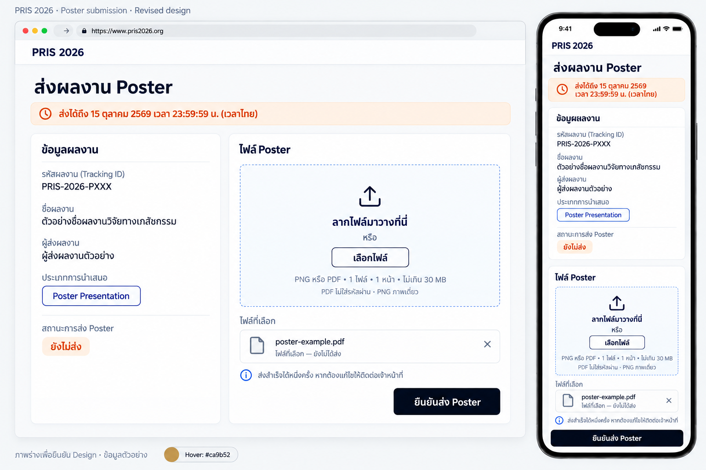
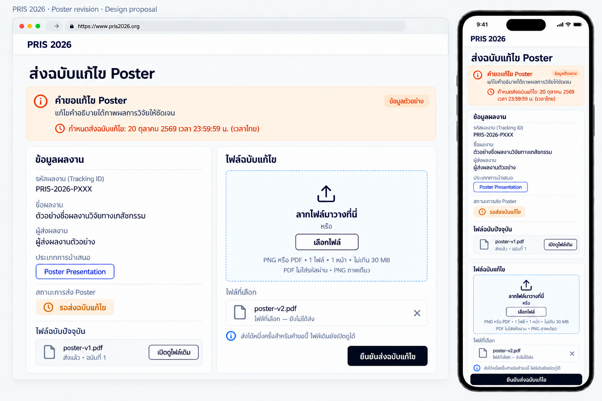

# PRIS 2026 — ระบบรับ Poster

วันที่: 6 ตุลาคม 2569 (2026-10-06), Asia/Bangkok

สถานะ: ผู้ใช้ยืนยันข้อกำหนดและ Layout แล้ว และสั่งให้เขียน implementation plan เมื่อ 7 ตุลาคม 2569

ครอบคลุม: conference-api, conference-backoffice และ Pris2026

## 1. ผลลัพธ์และขอบเขต

เพิ่มระบบแจ้งให้ส่ง Poster รับไฟล์ ติดตาม และขอแก้ไข โดยผูกข้อมูลกับ abstractId จริงของผลงานเดิม ทุกผลงานมีสถานะ สิทธิ์ส่ง ประวัติอีเมล และไฟล์ของตัวเอง แม้ผู้ส่งหรืออีเมลเดียวกัน

- รับทั้ง Poster Presentation และ Highlighted Poster Presentation โดยเทียบประเภทกับฐานข้อมูลเป็น poster
- Oral คงอยู่ในหน้าประกาศสาธารณะ แต่ไม่เปิดสิทธิ์ส่ง Poster
- ใช้ NipaMail, PostgreSQL/Drizzle, Fastify และ R2 bucket เดิม
- หน้าผู้ส่งและข้อความสถานะรองรับไทย/อังกฤษตาม next-intl เดิม
- ไม่เปลี่ยนสถานะ abstract และไม่ใช้ Accepted การลงทะเบียน การชำระเงิน หรือการยืนยันเข้าร่วมเป็นเงื่อนไข
- หน้ารวม Poster สาธารณะเป็นงานถัดไป ครั้งนี้เปิด URL ไฟล์สาธารณะและเก็บข้อมูลเพื่อรองรับงานนั้น
- รายละเอียดจัดทำ Poster เอกสารแนบ และ template ไม่ถูกเติมเป็นกติกาเอง ร่างอีเมลแก้รายละเอียดภายหลังได้

ทางเลือกที่ยืนยัน: โมดูล Poster ผูกกับ abstract เดิม ใช้บริการเดิม แยกข้อมูลติดตามและคำขอแก้ไข Poster ออกจากการแก้ไข abstract

## 2. แหล่งข้อมูลและการย้ายหน้าประกาศ

ย้ายข้อมูลจาก Pris2026/src/data/approvedRound1Abstracts.ts ไปไฟล์ต้นทางใน conference-api และเพิ่ม Round 2 ที่ API ภายหลัง API เป็นแหล่งรายชื่อหลักเพียงแห่งเดียว

โครงสร้างประกาศเก็บ Tracking ID ชื่อผลงาน ชื่อผู้ส่ง ประเภทตามประกาศ สาขา ลำดับ และ Round รวมข้อมูลประกาศเดิมที่จำเป็นต่อหน้าเว็บ เช่น affiliation และแถวรอผลประกาศที่ค่าเป็น null

ต้องมีรหัสแถวประกาศที่คงที่เพื่ออ้างอิงการเปลี่ยนแปลง รหัสแถวประกาศและลำดับไม่ใช่ abstractId และไม่ใช้แทน foreign key ของผลงาน

ข้อมูล Round 1 ที่ตรวจจากต้นทางมี 119 แถว: Oral 31, Highlighted Poster 39, Poster 49 มี Tracking ID 117 แถว อีกสองแถวรอผลประกาศ รวมรายการประเภท Poster ที่มี Tracking ID ให้ตรวจ 87 รายการ ตัวเลขนี้ยังไม่ใช่จำนวนที่จับคู่ฐานข้อมูลผ่าน

หน้า approved-abstracts อ่านประกาศผ่าน API โดยรักษาหน้าตา การค้นหา ตัวกรอง การจัดกลุ่ม ลำดับ และรองรับ Round 2 เมื่อเพิ่มข้อมูลแล้ว ปรับการอ่านข้อมูลเป็น asynchronous พร้อมสถานะโหลด ล้มเหลว/ลองใหม่ และยังไม่มีประกาศของ Round ที่เลือก โดยไม่ fallback ไปสำเนารายชื่อใน frontend

ปุ่มดาวน์โหลด PDF Round 1 คงข้อความ ตำแหน่ง URL และการทำงานเดิมทั้งหมด เจ้าหน้าที่นำ PDF ใหม่มาแทนไฟล์เดิมเอง ไม่เพิ่มข้อความประกาศฉบับเดิม ไม่ซ่อนปุ่ม และไม่สร้าง PDF อัตโนมัติ

Public API ส่งเฉพาะข้อมูลประกาศ ไม่ส่งอีเมลเจ้าของ ผลจับคู่ ผู้รับรอง งานอีเมล หรือคำขอแก้ไขภายใน

## 3. การตรวจจับคู่

ค้นหา Tracking ID ปัจจุบันและรหัสเดิมใน abstract_tracking_identifiers ภายใน Event ที่มี eventCode PRIS-2026 เท่านั้น ไม่ใช้ prefix O/P ตัดสินประเภทประกาศ

ก่อนเทียบชื่อผู้ส่ง ให้ใช้ Unicode normalization และจัดช่องว่างให้สม่ำเสมอ ไม่ตัดคำนำหน้า ไม่แก้การสะกด และไม่ใช้ fuzzy matching รูปแบบชื่อสำหรับตรวจคือชื่อบัญชีผู้ส่งที่ผูกกับ abstract ในฐานข้อมูล

Poster และ Highlighted Poster เทียบเป็น poster; Oral เทียบเป็น oral เก็บประเภทตามประกาศไว้สำหรับแสดงและกรอง ไม่เพิ่ม highlighted-poster ใน enum abstract เดิม

| ผลตรวจ | ผลต่อสิทธิ์ |
| --- | --- |
| รหัสปัจจุบัน ชื่อผู้ส่ง ชื่อผลงาน และประเภทตรง | พร้อมใช้งาน |
| พบผ่านรหัสเดิม และข้อมูลอื่นตรง | รอ Admin รับรอง |
| ชื่อผู้ส่ง ชื่อผลงาน หรือประเภท Oral/Poster ขัดกัน | พักจนแก้ข้อมูลและตรวจซ้ำผ่าน |
| ไม่พบ ข้อมูลไม่ครบ หรือจับคู่กำกวม/ซ้ำ | แสดงปัญหา ไม่จับคู่แทน |
| ไม่มีบัญชีผู้ส่งหรืออีเมลไม่ถูกต้อง | แสดงปัญหาและพักการส่งอีเมล ไม่มีผู้รับแทน |

การรับรองรหัสเดิมต้องบันทึก Admin เวลา เหตุผล รหัสประกาศ รหัสปัจจุบัน abstractId และ snapshot ข้อมูลที่ตรวจ การรับรองไม่ใช้ข้ามความขัดแย้งของชื่อ ชื่อผลงาน หรือ Oral/Poster ตามกติกาที่ผู้ใช้ยืนยันภายหลัง

ไม่แก้ abstract หรือบัญชีเดิมอัตโนมัติ หากข้อมูลสำคัญเปลี่ยน ผลตรวจ/การรับรองต้องตรวจความถูกต้องใหม่ ไม่ใช้การรับรองเก่ากับข้อมูลคนละชุด

หลายแถวชี้ abstract เดียวกันให้แสดงความขัดแย้ง ไม่รวมแถวเงียบ ๆ หากแถวที่เคยผูกผลงานเปลี่ยนไปชี้คนละ abstract ต้องพักและไม่ย้ายประวัติอีเมลหรือไฟล์ไปผลงานใหม่อัตโนมัติ

## 4. การอัปเดตหลัง deploy

API ตรวจและ reconcile รายชื่ออัตโนมัติเมื่อเริ่มทำงานหลัง deploy โดยใช้ transaction/lock ใน PostgreSQL ป้องกันหลาย instance สร้างข้อมูลซ้ำ สำเนาประกาศในฐานข้อมูลเป็นผลจากไฟล์ต้นทาง ไม่เป็นแหล่งแก้รายชื่ออีกแห่ง

- สร้าง/ปรับผลตรวจและรายการติดตามที่ผูกกับ abstractId จริง
- ตรวจฐานข้อมูลปัจจุบันด้วย ไม่ข้ามการตรวจเพียงเพราะไฟล์รายชื่อมี hash เดิม
- deploy ซ้ำต้องไม่สร้างรายการติดตามหรือประวัติรับรองซ้ำ
- รักษางานอีเมล ไฟล์ทุกฉบับ current upload คำขอแก้ไข และสิทธิ์ที่ใช้แล้ว
- กำหนดส่งเริ่มต้นใช้เมื่อสร้าง settings ครั้งแรก ไม่เขียนทับค่าที่ Admin แก้ไว้หลัง deploy
- ไม่มีการส่งเมลแจ้งหรือเตือนจากการ reconcile
- หาก reconciliation ล้มเหลว ต้องรายงานความผิดพลาดและพักการจัดการที่อาศัยผลตรวจไม่ครบ ไม่ใช้รายการตรวจครึ่งชุดเปิดสิทธิ์ส่ง

Admin ตรวจซ้ำหลังแก้ฐานข้อมูลได้โดยไม่ต้องนำเข้าไฟล์อีกครั้ง ก่อนส่งเมลหรือรับไฟล์ API ตรวจเงื่อนไขปัจจุบันซ้ำเพื่อไม่ใช้ผล stale

เมื่อเอาผลงานออกจากต้นทาง ให้พักสิทธิ์ส่งครั้งแรกและการแจ้ง/เตือนของผลงานนั้น เก็บ target และประวัติทั้งหมดไว้ ไม่ลบไฟล์ คำขอแก้ไขที่ยังเปิดอยู่คงอยู่ให้ Admin ตรวจและยกเลิกเอง การกลับมาในรายชื่อใช้ target เดิมและไม่คืนสิทธิ์ที่ใช้แล้ว

## 5. บัญชีและสิทธิ์

| ผู้ใช้ | ดู | จัดการ |
| --- | --- | --- |
| Admin | ทุกข้อมูลของระบบ Poster | ตรวจ/รับรอง ส่งเมล/ส่งซ้ำ ตั้ง deadline ขอแก้ไข และยกเลิกคำขอ |
| Organizer | รายชื่อ ผลตรวจ deadline ไฟล์และประวัติ ภายใน Event ที่ได้รับมอบหมาย | ไม่ได้ |
| Reviewer | ข้อมูลเดียวกันภายใน Event ที่ได้รับมอบหมาย | ไม่ได้ |
| บัญชีผู้ส่ง | หน้าส่งและคำขอของ abstract ที่เป็นเจ้าของ | ส่งตามสิทธิ์และ deadline |
| บุคคลทั่วไป | URL ไฟล์ Poster บน R2 | ส่งไฟล์ไม่ได้ |

ตรวจทั้งหน้าเว็บและ API ใช้ role และ Event assignment ปัจจุบันของบัญชี Backoffice ไม่ใช้การซ่อนปุ่มเป็นมาตรการสิทธิ์ และไม่ใช้เพียง JWT verify หรือเลข id โดยไม่แยกประเภทบัญชีผู้เข้าร่วมกับ Backoffice

ผู้ส่งต้อง Login แล้ว API ตรวจว่า users.id ของบัญชีผู้เข้าร่วมตรงกับ abstracts.user_id ของ abstractId นั้น ไม่ใช้ email string หรือการมีลิงก์แทน ownership

ถ้ายังไม่ Login ให้เข้าหน้า Login เดิมแล้วกลับมายัง abstractId และ revisionRequestId เดิมโดยอัตโนมัติ ใช้ redirect ภายในเว็บไซต์เท่านั้น รักษา URL เมื่อ reload และเปลี่ยนภาษา

ถ้าบัญชีผิด ให้แสดง “กรุณาเข้าสู่ระบบด้วยบัญชีที่ใช้ส่งบทคัดย่อของผลงานนี้” พร้อมเปลี่ยนบัญชี ไม่คืนอีเมลเต็มของเจ้าของหรือรายละเอียดคำขอภายในให้บัญชีอื่น

สิทธิ์ส่งไม่ได้ขึ้นกับผลส่งอีเมล รายชื่อที่ตรวจผ่าน ownership สิทธิ์คงเหลือ และ deadline เป็นเงื่อนไขหลัก คำขอแก้ไขเดิมที่ยังเปิดหลังถอดรายชื่อยังใช้สิทธิ์เฉพาะคำขอได้จนสิ้นสุดหรือ Admin ยกเลิก โดยยังตรวจ ownership เดิมจากฐานข้อมูล

## 6. ไฟล์และ R2

รับหนึ่งไฟล์ต่อหนึ่งการส่ง ขนาด 1 ถึง 30 × 1024 × 1024 bytes ใช้หน่วยและข้อความ “30 MB” ตามข้อจำกัดฟอร์ม abstract เดิม ไม่เปลี่ยนต้นฉบับหลังรับ

- รับ PNG หรือ PDF เท่านั้น ตรวจนามสกุล MIME และชนิดไฟล์จริงจากเนื้อหา
- PDF ต้องอ่านโครงสร้างได้ มีหนึ่งหน้า และไม่มี encryption/password ใช้ parser จริง ไม่ใช้ regex นับ /Page หรือเพียงค้นข้อความ /Encrypt
- PNG ต้องเป็นภาพเดี่ยว อ่านไฟล์ได้ และไม่มีโครงสร้างภาพเคลื่อนไหว/หลายเฟรม ตรวจ APNG จากโครงสร้าง chunks ไม่เชื่อเพียง MIME หรือชื่อไฟล์
- ไม่กำหนดขนาดภาพ ความละเอียด DPI หรือแนวตั้ง/แนวนอน และไม่ใช้เพดาน pixels/1600 px ของ Lucky Wheel มาปฏิเสธ Poster
- ไฟล์เสีย/ไม่ผ่านต้องแจ้งเหตุผลและไม่ใช้สิทธิ์ หากระบบประมวลผลหรือเครือข่ายล้มเหลวให้รายงานว่าไม่สำเร็จและลองใหม่ได้ โดยไม่กำหนดข้อห้ามเรื่องความละเอียดขึ้นเอง

เก็บใน R2 bucket เดิม prefix events/{eventId}/posters/{abstractId}/{uploadId}.{png|pdf} ด้วย key สุ่มไม่ใช้ชื่อ/อีเมลคนเป็น key ระบุ Content-Type จริง ใช้ r2.dev/public base เดิม URL ไฟล์เปิดสาธารณะได้ รวมไฟล์ก่อนหน้าที่เก็บเป็นประวัติ

ฐานข้อมูลเก็บ object key ชื่อไฟล์เดิม MIME ขนาด digest เวลารับ ผู้ส่ง เลขฉบับ และ revision request ที่เกี่ยวข้อง ไม่ไล่หาไฟล์ใน bucket เพื่อสร้างรายชื่อผลงาน

เลือก Browser → API → R2 เพราะตรวจไฟล์และสิทธิ์ได้ในเส้นทางเดียวด้วยการเชื่อมต่อเดิม ไม่เพิ่ม direct-upload/presigned flow ในงานนี้

บันทึกสำเร็จได้เมื่อไฟล์ผ่าน validation และ R2 กับฐานข้อมูลบันทึกครบ ปัญหา R2/DB ไม่เปลี่ยน current upload ไม่ใช้สิทธิ์ และไม่ลบฉบับก่อน การเก็บกวาด best-effort ลบได้เฉพาะ object ใหม่ของ attempt ที่ไม่สำเร็จ หากลบล้มเหลวให้บันทึกปัญหาและเก็บกวาดต่อได้ ห้ามลบ object ที่อ้างอิงโดย upload สำเร็จหรือประวัติ

## 7. Deadline และการรับสำเร็จ

Round 1 และ Round 2 ใช้ deadline หลักเดียวกัน: 15 ตุลาคม 2569 เวลา 23:59:59 น. เวลาไทย รับตลอดวินาทีนั้นและปิดที่ 16 ตุลาคม 2569 เวลา 00:00:00 Asia/Bangkok หรือ 2026-10-15T17:00:00.000Z

เก็บเวลาปิดรับแบบ exclusive และมี timezone offset/UTC ชัดเจน ใช้เวลาเซิร์ฟเวอร์ ผู้ส่งต้องรับและตรวจเสร็จทันกำหนด การเริ่มอัปโหลดทันแต่ตรวจเสร็จหลังปิดไม่สำเร็จ

ก่อนบันทึกรับสำเร็จ ตรวจเวลาปัจจุบันและสิทธิ์อีกครั้งภายใต้ transaction/lock ของ target/request ไม่ใช้เวลาที่เริ่ม transaction หรือเวลาเริ่มส่งแทน หากหมดกำหนดระหว่างรับ ตรวจ หรือจัดเก็บก่อน finalization ให้ปฏิเสธและรักษาไฟล์เดิม

Admin เปลี่ยน deadline หลักผ่าน Backoffice พร้อม audit ผู้เปลี่ยน เวลา ค่าเดิม/ใหม่ การขยาย deadline ไม่คืนสิทธิ์ส่งครั้งแรกที่ใช้แล้ว และไม่เปลี่ยน deadline คำขอแก้ไข

คำขอแก้ไขใช้ closesAt เฉพาะคำขอและเงื่อนไขเวลาเดียวกัน การปิดรับทำงานจาก API/server time แม้ browser เปิดค้างอยู่ ไม่ต้องพึ่ง job ที่ตั้งเวลาแจ้งเตือน

## 8. การส่งครั้งแรกและคำขอแก้ไข

หนึ่ง abstract ส่งครั้งแรกสำเร็จได้หนึ่งครั้ง หลังสำเร็จให้ล็อกการส่งซ้ำ ผู้ส่งยังดูไฟล์ได้แต่เปลี่ยนหรือลบเองไม่ได้

Admin ขอแก้ไขผลงานที่มี Poster แล้ว โดยระบุรายละเอียดและ deadline ที่ยังไม่ผ่าน สร้างคำขอและงานอีเมลแจ้งคำขอใน transaction เดียวกัน การส่งเมลล้มเหลวไม่ rollback คำขอหรือสิทธิ์

| สถานะคำขอ | ความหมาย |
| --- | --- |
| open | ยังไม่ใช้สิทธิ์ ไม่ยกเลิก และยังไม่ปิดรับ |
| submitted | ส่งฉบับแก้ไขสำเร็จแล้ว |
| expired | พ้นกำหนดก่อนส่งสำเร็จ |
| cancelled | Admin ยกเลิกพร้อมเหตุผล |

แต่ละผลงานมีคำขอที่ใช้งานได้ครั้งละหนึ่งคำขอ ป้องกันการสร้างซ้อนด้วย lock/constraint ในฐานข้อมูล ไม่ตรวจเฉพาะหน้าเว็บ คำขอหมดเวลาใช้สถานะ effective ตาม server time; เมื่อสร้างคำขอถัดไปให้ปิดสถานะค้างของคำขอเดิมอย่างสอดคล้องโดยไม่ต้องเพิ่มงาน timer

รายละเอียดและ deadline ของคำขอแก้ไขแก้ย้อนหลังไม่ได้ การเปลี่ยนเงื่อนไขต้องยกเลิกพร้อมเหตุผลแล้วสร้างคำขอใหม่ คำขอที่ submitted/expired/cancelled ไม่เปิดกลับมาใช้อีก

การยกเลิกบันทึก Admin เวลา และเหตุผล ปิดสิทธิ์ของ request เดิม ถ้ายกเลิกระหว่างอัปโหลด API ตรวจซ้ำก่อน finalization แล้วปฏิเสธ attempt นั้น ไฟล์เดิมไม่เปลี่ยน การยกเลิกและการส่งแข่งกันต้องตัดสินภายใต้ lock เดียวกัน ไม่จบเป็นทั้ง cancelled และ submitted

เมลฉบับแก้ไขมี abstractId และ revisionRequestId เฉพาะคำขอ ลิงก์เก่าต้องอ่านสถานะ request จริงและไม่ส่งไฟล์ผ่าน request ที่หมดเวลา/ยกเลิกไปยัง request ใหม่อัตโนมัติ

แต่ละคำขอส่งสำเร็จได้ครั้งเดียว validation/network/storage/DB failure ไม่ใช้สิทธิ์ คำขอเดิมยังใช้ซ้ำได้ก่อนปิดรับ เมื่อสำเร็จใหม่เป็น current upload และเก็บทุกฉบับก่อนหน้าไว้

ส่งเมลซ้ำจากคำขอเดิมใช้รายละเอียดและ deadline เดิม ไม่มีสิทธิ์เพิ่ม ไม่มีคำขอใหม่ และไม่มีการขยายเวลา หลังคำขอสิ้นสุดแสดงประวัติและไม่ส่งเมลที่สื่อว่ายังใช้คำขอนั้นส่งได้

## 9. สถานะติดตาม

แยกสถานะ Poster ผลจับคู่ สถานะคำขอ และสถานะอีเมลออกจากกัน

| สถานะ Poster บนหน้าติดตาม | เงื่อนไข |
| --- | --- |
| ยังไม่ส่ง | ยังไม่มี successful upload |
| ส่งแล้ว | มีฉบับแรกและไม่มีคำขอ active |
| รอส่งฉบับแก้ไข | มีคำขอ active ที่ยังไม่ได้ส่ง |
| ส่งฉบับแก้ไขแล้ว | current upload เป็นฉบับแก้ไขและไม่มีคำขอ active |

เมื่อคำขอหมดเวลา ให้แสดง “คำขอแก้ไขหมดเวลา” พร้อมสถานะไฟล์ปัจจุบัน ประวัติ และปิดการส่ง ไม่สื่อว่าไฟล์เดิมหายไป เมื่อยกเลิกให้แสดงคำขอถูกยกเลิกพร้อมเหตุผลสำหรับผู้มีสิทธิ์

หนึ่ง target มี current upload เดียว แต่ทุก successful upload เป็นประวัติถาวร ไฟล์ที่เลือก/preview ฝั่ง browser ยังไม่ใช่ successful upload

## 10. อีเมลและ Modal

ใช้อีเมลของบัญชีผู้ส่งที่ผูกผ่าน abstractId ตามฐานข้อมูล ไม่มี fallback ไปผู้นำเสนอหรือ co-author หนึ่งผลงานหนึ่งเมล แม้อีเมลตรงกับผลงานอื่น

| ชนิด | จุดสร้างงานส่ง |
| --- | --- |
| แจ้งส่งครั้งแรก | Admin เลือกรายการและกดส่ง |
| เตือนยังไม่ส่ง | Admin เลือกรายการที่ยังไม่ส่งและกดส่ง |
| แจ้งคำขอแก้ไข | Admin สร้างคำขอ และส่งซ้ำจากคำขอเดิมได้ |
| ยืนยันรับไฟล์ | อัตโนมัติหนึ่งงานต่อ successful upload ทั้งครั้งแรกและแก้ไข |

ไม่มี scheduled/automatic reminder ไม่มีเมลจากการ deploy หรือ reconcile การยกเลิกคำขอบันทึกสถานะให้หน้าเว็บอ่านปัจจุบัน ไม่เพิ่มอีเมลยกเลิกที่ผู้ใช้ไม่ได้กำหนด

Admin preview ผู้รับ ผลงาน หัวข้อ และเนื้อหาก่อนส่งจริง ร่างใช้รูปแบบเมล PRIS เดิมและช่องทาง pr@pharmactcouncil.org ตามผู้ใช้ระบุ เก็บฉบับเนื้อหาที่ส่งจริงไว้ในประวัติ

งานอีเมล durable ในฐานข้อมูล ใช้รูปแบบ claim/outbox และ NipaMail transport ที่มีอยู่ ไม่ต้องเพิ่ม message broker/general email framework แยกงาน Poster จาก feature flags และข้อมูล session-grants

สถานะ: pending, sending, sent (ผู้ให้บริการตอบรับ), failed, unknown และ suppressed สำหรับงานที่เงื่อนไขเปลี่ยนก่อนส่ง sent ไม่หมายความว่าถึง inbox ไม่มีการเพิ่ม tracking pixel/delivery webhook ในงานนี้

บันทึกผู้สั่งส่ง/ระบบ เวลา recipient snapshot ชนิด abstractId uploadId/requestId/batchId ที่เกี่ยวข้อง subject/body template version และผลส่งแต่ละครั้ง ป้องกันคำขอเดิมซ้ำด้วย idempotency การส่งซ้ำที่ Admin ตั้งใจทำสร้าง attempt ใหม่และรักษาผลก่อนหน้า

ก่อนส่งงานแจ้ง/เตือน/คำขอ ให้ตรวจ ownership/ผู้รับ และความเหมาะสมปัจจุบัน เช่น ถอดรายชื่อ ส่งไฟล์แล้ว คำขอสิ้นสุด หรือข้อมูลเปลี่ยนจาก preview ให้พัก/ข้ามพร้อมเหตุผลและให้ Admin ตรวจ ไม่ส่งตาม snapshot ที่ stale เงียบ ๆ unknown ไม่ retry อัตโนมัติ เพราะอาจส่งไปแล้ว failed ให้ Admin ส่งซ้ำจากรายการเดิม

งานยืนยันรับสร้างพร้อม transaction ที่รับไฟล์ เพื่อไม่หายเมื่อ process หยุดหลัง commit แต่ก่อนส่งเมล ทำซ้ำ API คำขอเดิมไม่สร้าง receipt งานใหม่ ถ้าเมลล้มเหลว upload ยังสำเร็จและสิทธิ์ถูกใช้แล้ว Admin ส่งยืนยันซ้ำจาก upload เดิมได้

Modal แสดง “ระบบได้รับไฟล์ Poster แล้ว” พร้อม Tracking ID ชื่อผลงาน ชื่อไฟล์ ฉบับ และเวลารับจาก server มีปุ่มดูไฟล์และปิด dialog ไม่สื่อว่าผ่านการพิจารณาหรืออนุมัติ ถ้า response หายหลัง commit ให้ retry ด้วย idempotency/read current state แล้วแสดงผลเดิม ไม่รับฉบับซ้ำ

### ร่างเมลแจ้งครั้งแรก (ข้อความตัวแปรใช้ข้อมูลจริง)

หัวข้อ: PRIS 2026 — แจ้งส่งไฟล์ Poster สำหรับผลงาน {trackingId}

เรียน {submitterName}

ขอแจ้งให้ท่านส่งไฟล์ Poster สำหรับผลงาน {trackingId} เรื่อง {title}

กรุณาส่ง PNG หรือ PDF จำนวนหนึ่งไฟล์ มีเนื้อหาหนึ่งหน้า ขนาดไม่เกิน 30 MB โดย PDF ไม่ใส่รหัสผ่าน และ PNG เป็นภาพเดี่ยว

กำหนดส่ง: {deadlineDisplay} (เวลาไทย)

กรุณาใช้ลิงก์ {submissionUrl} และ Login ด้วยบัญชีที่ใช้ส่งบทคัดย่อของผลงานนี้ ระบบถือว่าส่งสำเร็จเมื่อรับ ตรวจ และบันทึกไฟล์สำเร็จ หลังส่งแล้ว หากต้องแก้ไขกรุณาติดต่อเจ้าหน้าที่

สอบถามเพิ่มเติม: pr@pharmactcouncil.org

เนื้อหาอังกฤษใช้ความหมายเดียวกัน เช่น “Please sign in with the account used to submit this abstract. Upload one single-page PNG or unencrypted PDF, up to 30 MB, before {deadlineDisplay} (Bangkok time).” ไม่มีข้อกำหนดการพิมพ์ที่ไม่ได้รับยืนยัน

เมลแก้ไขเพิ่ม {revisionDetails}, {revisionDeadlineDisplay} และลิงก์ request เฉพาะ เมลเตือนใช้ข้อกำหนดและ deadline ปัจจุบัน เมลยืนยันใช้ข้อความ “ระบบได้รับไฟล์ Poster แล้ว / The system has received your Poster file” พร้อมข้อมูลไฟล์และเวลา ไม่ประกาศผลพิจารณา

## 11. หน้าผู้ส่งและธีมเดียวกัน

URL ครั้งแรก: /[locale]/poster-submission?abstractId={abstractId}; URL แก้ไขเพิ่ม revisionRequestId ของคำขอนั้น ใช้หน้า/องค์ประกอบชุดเดียวเพื่อไม่ให้ธีมแยกกัน

| Token | ใช้ทั้งสองสถานะ |
| --- | --- |
| พื้น | #fafafa |
| การ์ด | #ffffff ขอบบาง สี slate-100/200 และเงานุ่ม |
| ตัวอักษร | #0f172a; ข้อความรอง slate |
| ปุ่มหลัก | #020617 ตัวอักษรขาว |
| Hover ปุ่มหลัก | #ca9b52 ตัวอักษรดำ |
| ปุ่มรอง | ขอบและตัวอักษร slate; พื้นขาว |
| แถบ deadline/คำขอ | #fff7ed ขอบ #fed7aa เวลา/ไอคอน #c2410c |
| สีประกอบ | น้ำเงินสำหรับประเภท/ข้อมูลเหมือนกันทั้งสองสถานะ เขียวเฉพาะผลรับสำเร็จ แดงเฉพาะข้อผิดพลาด |
| ฟอนต์ | Outfit และ Noto Sans Thai ที่ติดตั้งใน Pris2026 อยู่แล้ว |

คง Header/Footer และ locale เดิม หัวข้อกระชับไม่มี hero สูงหรือ stepper ผู้ใช้ไม่กรอก abstract ผู้เขียน หรือข้อมูลผลงานใหม่ Desktop ข้อมูลซ้าย พื้นที่ส่งขวา; mobile เรียงลงและปุ่มหลักเต็มความกว้าง

แสดง Tracking ID ชื่อผลงาน ผู้ส่ง ประเภทตามประกาศ สาขา Round deadline และสถานะ แสดงข้อกำหนดไฟล์ใกล้ input ข้อมูลสำคัญไม่ซ่อนไว้ใน tooltip

แถวไฟล์ที่เลือกเป็น neutral พร้อมชื่อ ขนาด ปุ่มเอาไฟล์ที่เลือกออก และคำว่า “ยังไม่ได้ส่ง” ปุ่มนี้ใช้กับไฟล์ที่ยังไม่ส่งเท่านั้น ไม่มีปุ่มลบ successful upload

PNG preview ได้ก่อนส่ง; PDF มีเปิดดูและใช้ native browser viewer พร้อม fallback เมื่อมือถือ embed ไม่ได้ ระหว่างรับ/ตรวจ/บันทึกแสดงขั้นตอน progress และ disable การกดย้ำ ไม่แสดงเปอร์เซ็นต์ 100 เป็นการรับสำเร็จก่อน API ยืนยัน

สถานะครบ: loading, Login required, wrong owner, ready, validation error, receiving/checking/saving, success Modal, locked/submitted, active revision, expired/cancelled revision, initial deadline passed และ retryable server/network failure

เพิ่ม route นี้ในการรักษา redirect หลัง Login และ exception ของ refreshRedirect ใช้ safe internal redirect รวม abstractId/requestId และไม่ทำให้ F5 หรือเปลี่ยนภาษาเสีย context

ใช้ file input และปุ่มที่ keyboard ใช้ได้ focus ชัดเจน live status สำหรับการส่ง ข้อผิดพลาดไม่อาศัยสีอย่างเดียว Modal จัดการ focus/ปุ่มปิด/คืน focus และรองรับ reduced motion ภาษาไทยไม่ใช้ tracking กว้างผิด baseline เดิม

### ภาพร่างที่ยืนยัน Layout

ภาพเป็นข้อมูลตัวอย่าง Deadline แก้ไข 20 ตุลาคมในภาพไม่ใช่ค่า default ของคำขอ ค่าจริงมาจาก Admin ภาพอ้างอิงองค์ประกอบ ส่วนกติกาและ tokens ในเอกสารเป็นข้อกำหนดหลัก รวม TH/EN สาขา Round และ success Modal ที่ต้องมีใน implementation

## 12. Backoffice

หน้า /posters อยู่ในกลุ่ม Abstracts ของ Backoffice ใช้ AdminLayout และ design tokens ของ Backoffice เดิม ไม่เปลี่ยนธีมทั้งระบบ

สามแท็บ: ตรวจรายชื่อ / ติดตามและอีเมล / Poster ที่ได้รับ

- ตรวจรายชื่อ: เลือก Round ค้นหา กรองประเภทตามประกาศ/ผลตรวจ ดูข้อมูลสองฝั่ง Admin รับรอง alias และตรวจซ้ำ ไม่มีปุ่มนำเข้า เพราะ deploy ทำอัตโนมัติ
- ติดตาม: ตารางหนึ่งแถวต่อ abstractId พร้อมชื่อผลงาน ผู้ส่ง อีเมล Round ประเภท ผลจับคู่ สถานะ Poster เมลล่าสุด เวลารับ current file และ deadline ที่มีผล
- อีเมล: Admin เลือกรายการ ดูจำนวนผลงาน/จำนวนเมล preview และส่ง เงื่อนไขไม่ผ่านเลือกส่งไม่ได้; ผู้ส่งเดียวสามผลงานเท่ากับสามเมล
- Poster ที่ได้รับ: ตารางค้นหา/กรองและเปิดรายละเอียด preview/current file/history ไม่สร้าง gallery สาธารณะในงานนี้
- Settings: Admin เปลี่ยน deadline หลักแสดง Asia/Bangkok พร้อม history

รายละเอียด /posters/[abstractId] มีข้อมูลประกาศ/ฐานข้อมูล ประวัติรับรอง current upload และไฟล์ทุกฉบับ ประวัติคำขอแก้ไข รวมผู้ขอ รายละเอียด เวลาสร้าง deadline สถานะ ผู้ยกเลิก/เหตุผล ผลอีเมล และเวลารับไฟล์ที่ตอบคำขอนั้น

Admin สร้างคำขอผ่าน dialog แสดงผลงาน รายละเอียด deadline และ preview เมล; ยกเลิกผ่าน dialog ที่ต้องกรอกเหตุผล ไม่เพิ่มสิทธิ์แก้ข้อความ/deadline ของ request เดิม Organizer/Reviewer มีหน้าดูเดียวกันแต่ไม่มี controls จัดการ

## 13. ขอบเขตข้อมูลถาวร

| กลุ่มข้อมูล | หน้าที่และ invariant |
| --- | --- |
| Poster settings | หนึ่งชุดต่อ Event deadline หลักและ audit |
| Announcement rows / reconciliation | Snapshot จากไฟล์ ผลตรวจ source hash stable source row key และปัญหาของแถวที่ยังไม่มี abstractId |
| Poster targets | หนึ่งต่อ Event/abstractId ข้อมูลพร้อมใช้/ถอนจากรายชื่อ current upload และผลรับรองที่ตรวจความสดได้ |
| Poster uploads | Successful version ที่ไม่เขียนทับ เชื่อม target/request และ R2 metadata |
| Poster revision requests | ข้อความ/deadline คงเดิม ผู้สร้าง/ยกเลิก ผลลัพธ์และ upload ที่ใช้สิทธิ์ หนึ่ง active ต่อ target |
| Poster email jobs/attempts | Durable queue, immutable sent payload และประวัติการส่งแต่ละครั้ง |
| Audit | รับรอง เปลี่ยน deadline สร้าง/ยกเลิก request และการเปลี่ยนผลจับคู่ ใช้รูปแบบ audit ที่มีในระบบเท่าที่เหมาะสม |

แต่ละกลุ่มข้อมูลมีวงจรและความสัมพันธ์ตามตารางนี้ บังคับ uniqueness ของ target ต่อ Event/abstractId ของ successful upload ครั้งแรกต่อ target และฉบับแก้ไขต่อ request ในฐานข้อมูล ไม่สร้าง abstract/user ซ้ำ ไม่แก้ enum abstract status/type และไม่รวม Poster uploads กับ abstract_files ที่ยังใช้ Google Drive

## 14. API contract

ใช้ REST resource paths และ response/error conventions เดิม Endpoint ใหม่ไม่ทำให้ endpoint abstract เก่าหรือ clients อื่นเปลี่ยนสัญญา Public announcement read-only และไม่กรองด้วย Accepted

| Method / Path | ผู้ใช้ | การทำงาน |
| --- | --- | --- |
| GET /api/events/:eventCode/approved-abstracts | สาธารณะ | ประกาศ Round 1/2 เท่านั้น อ่านครบเพื่อคง client filters เดิม |
| GET /api/abstracts/:abstractId/poster | เจ้าของ | ข้อมูลส่ง current file history และ request ที่เปิด/ระบุ |
| POST /api/abstracts/:abstractId/poster-uploads | เจ้าของ | multipart หนึ่งไฟล์ requestId เฉพาะเมื่อแก้ไข และ Idempotency-Key |
| GET /api/backoffice/events/:eventId/poster-targets | Admin / Organizer / Reviewer ที่มีสิทธิ์ | รายชื่อและผลตรวจ รวมแถวที่ยังจับคู่ไม่ได้ มี pagination/filters |
| POST /api/backoffice/events/:eventId/poster-reconciliations | Admin | ตรวจซ้ำจากต้นทางปัจจุบัน ไม่รับไฟล์/รายชื่อจาก client |
| POST /api/backoffice/events/:eventId/poster-verifications | Admin | รับรอง alias ที่ข้อมูลอื่นตรง บันทึกเหตุผล/snapshot |
| GET /api/backoffice/events/:eventId/poster-settings | Role ที่มีสิทธิ์ดู | deadline และ history |
| PATCH /api/backoffice/events/:eventId/poster-settings | Admin | เปลี่ยน deadline หลักพร้อม audit |
| POST /api/backoffice/events/:eventId/poster-email-previews | Admin | สร้าง preview ผู้รับ/ผลงาน/เนื้อหาจากข้อมูลจริง รวมรายละเอียด/deadline ที่กำลังกรอกสำหรับ request ใหม่ โดยไม่สร้างสิทธิ์หรือส่งเมล |
| POST /api/backoffice/events/:eventId/poster-notification-batches | Admin | สร้างงานแจ้ง/เตือนจาก IDs ที่เลือกและ preview ที่ตรงกับข้อมูลปัจจุบัน |
| GET /api/backoffice/events/:eventId/poster-notification-batches/:batchId | Role ที่มีสิทธิ์ดู | ผลงานและผลเมลรายรายการ |
| GET /api/backoffice/events/:eventId/poster-targets/:abstractId | Role ที่มีสิทธิ์ดู | รายละเอียดทุกฉบับ คำขอ และประวัติเมล |
| POST /api/backoffice/events/:eventId/poster-targets/:abstractId/revision-requests | Admin | สร้าง request และงานเมลใน transaction |
| POST /api/backoffice/events/:eventId/poster-revision-requests/:requestId/cancellations | Admin | ยกเลิกพร้อมเหตุผล ไม่มีการลบ request |
| POST /api/backoffice/events/:eventId/poster-email-jobs/:jobId/resends | Admin | ส่งซ้ำจากงานเดิม/request/upload เดิม พร้อมประวัติใหม่ |

API ไม่รับ recipient ที่ client กำหนดเอง GET ไม่เปลี่ยนสิทธิ์หรือใช้สิทธิ์ preview คืน 200 โดยไม่ส่งหรือสร้าง durable job สร้าง resource คืน 201 สร้างงานส่งแบบ asynchronous คืน 202 file size คืน 413 ชนิดไม่รองรับ 415 เนื้อหาไฟล์ไม่ผ่าน 422 ไม่ Login 401 สิทธิ์ผิด 403/404 โดยไม่คืน PII และข้อมูล stale/สิทธิ์ใช้แล้ว/request สิ้นสุด/deadline ผ่านคืน 409 พร้อม code

ใช้ code เช่น POSTER_OWNER_REQUIRED, POSTER_NOT_ELIGIBLE, POSTER_ROSTER_CONFLICT, POSTER_ALREADY_SUBMITTED, POSTER_DEADLINE_PASSED, POSTER_REQUEST_CANCELLED, POSTER_REQUEST_EXPIRED, POSTER_ACTIVE_REQUEST_EXISTS, POSTER_FILE_TOO_LARGE, POSTER_FILE_INVALID และ POSTER_STORAGE_FAILED ให้หน้าเว็บแปลข้อความเอง

mutations มี idempotency key และ request fingerprint คำขอเดิมคืนผลเดิม key เดิมกับเนื้อหาต่างคืน conflict การส่งเมลซ้ำที่ตั้งใจทำใช้ action ใหม่ ทุก mutation ตรวจ role/Event/ownership และเงื่อนไขสดอีกครั้ง ยืนยัน successful upload/request exclusivity ด้วยฐานข้อมูล ไม่ถือว่า browser disabled ป้องกัน race ได้

## 15. เกณฑ์ตรวจรับ

1. ย้ายประกาศครบ 119 แถว คงชนิด/ลำดับ/null/ตัวกรอง/ปุ่ม PDF และเพิ่ม Round 2 ได้จาก API โดยไม่มี frontend สำเนารายชื่อ
2. Poster + Highlighted เทียบกับ DB poster ผ่าน; Oral ไม่ได้สิทธิ์ส่ง; prefix O/P ไม่ใช้ตัดสินชนิด
3. Current ID ข้อมูลตรงพร้อมใช้; alias ต้องรับรองพร้อมเหตุผล; Unicode/ช่องว่างจัดได้แต่คำนำหน้า/สะกด/ชื่อคล้ายไม่ข้ามข้อขัดแย้ง
4. ชื่อผู้ส่ง ชื่อผลงาน หรือประเภทขัดกันส่งเมล/ครั้งแรกไม่ได้ แก้แล้วตรวจซ้ำได้ และการรับรอง stale ใช้ต่อไม่ได้
5. deploy ซ้ำ/multi-instance ไม่สร้าง target ซ้ำ ไม่เปลี่ยน deadline ที่แก้ไว้ ไม่ล้างไฟล์/เมล/request และไม่ส่ง notification เอง
6. ลบจากต้นทางพักครั้งแรก/แจ้งเตือน เก็บประวัติและ active request ตามนโยบายที่ยืนยัน
7. ผู้ส่งเดียวหลายผลงานได้รับเมลแยกและการรับไฟล์หนึ่งผลงานไม่เปลี่ยนอีกผลงาน เจ้าของหาย/อีเมลผิดไม่ fallback
8. Login return/reload/เปลี่ยนภาษา/เปลี่ยนบัญชีรักษา abstractId/requestId; URL เปลี่ยนไม่ได้สิทธิ์; wrong owner ไม่ได้อีเมลเต็ม และ token Backoffice ไม่ใช้แทนบัญชีผู้ส่ง
9. Admin จัดการได้ Organizer/Reviewer ดูเฉพาะ Event ที่ได้รับสิทธิ์และเรียก mutation ตรงก็ไม่ได้ ผู้ส่งไม่ตรวจ Accepted/payment/registration/confirmation
10. PNG/PDF จริงหนึ่งไฟล์ไม่เกินขนาดผ่าน; file ปลอม PDF 0/หลายหน้า/encrypted APNG/หลายเฟรมและไฟล์เสียไม่ผ่าน โดยสิทธิ์ยังอยู่ ไม่กำหนด orientation/DPI/dimensions เพิ่ม
11. ปิดหลักตรง 16 ตุลาคม 00:00 ไทย ตรวจเสร็จ/ถึง finalization หลังปิดไม่ผ่าน browser clock ไม่เปลี่ยนผล deadline แก้ไขไม่เปิดให้ผลงานอื่น
12. ส่งครั้งแรกพร้อมกันสองแท็บสำเร็จหนึ่งฉบับเท่านั้น response หาย/retry idempotent ไม่สร้าง version หรือ receipt ซ้ำ
13. สร้าง request พร้อมกันได้หนึ่ง active; resend ไม่เปลี่ยนรายละเอียด/deadline/สิทธิ์; cancel มีเหตุผลและ audit; เปลี่ยนเงื่อนไขต้อง cancel/create ใหม่
14. Cancel/expire ระหว่างอัปโหลดปฏิเสธก่อน finalize; upload/cancel แข่งกันจบผลเดียว; stale requestId ไม่ไปใช้สิทธิ์ request ใหม่
15. validation/R2/DB failure ไม่ใช้สิทธิ์หรือเปลี่ยน current file และ cleanup ไม่ลบ historical successful upload; ฉบับใหม่สำเร็จแล้วเก็บฉบับเก่าครบ
16. Request mail failure คำขอยังอยู่ receipt mail failure upload ยังสำเร็จ unknown ไม่ retry เงียบ ๆ งานต่อจาก process restart ได้ และ Admin ส่งซ้ำจาก resource เดิมได้
17. Modal ใช้ server receipt และคำว่าได้รับไฟล์ ไม่มีคำยืนยันอนุมัติ; เลือกไฟล์/preview ไม่แสดงว่าส่งสำเร็จ
18. ทั้งสอง mode ใช้ palette/component tokens เดียวกัน ไทย/อังกฤษ desktop/mobile keyboard/focus/dialog/error/live progress ใช้งานได้
19. R2 URLs เปิดสาธารณะโดยไม่ Login แต่ owner/request API ยังมีสิทธิ์ หน้า gallery สาธารณะไม่ถูกเพิ่มในงานนี้

## 16. สถานะการทบทวน

ข้อกำหนดธุรกิจและตัวเลือกทั้งหมดได้รับคำตอบแล้ว เอกสารนี้รวมคำตอบล่าสุด โดยเฉพาะสิทธิ์ครั้งเดียว คำขอแก้ไขที่แก้ย้อนหลังไม่ได้ การตรวจซ้ำก่อน finalize การคงปุ่ม PDF และธีมเดียวกัน

Implementation plan บันทึกที่ `D:/confer/confer/conference/conference-api/docs/superpowers/plans/2026-10-07-pris2026-poster-submission.md` ตาม writing-plans ที่ผู้ใช้ร้องขอ ยังไม่ได้แก้ระบบหรือ deploy
