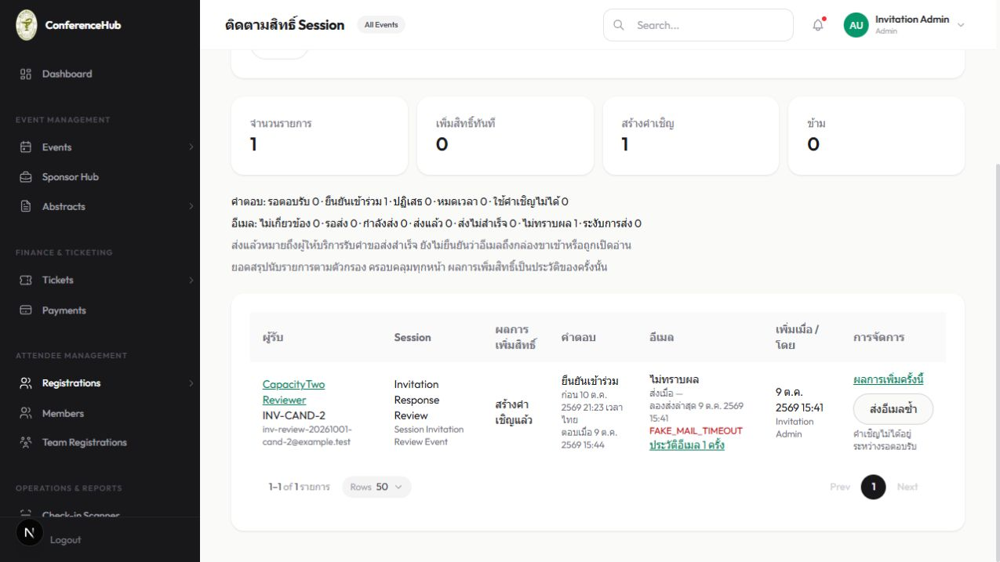

# Admin session grant tracking verification

Date: 2026-10-09 (Asia/Bangkok)

## Tested revisions and environment

Feature files were tested in API commit `516a927` on `feat/healthhack-booth-roles` and Backoffice commit `250af66` on `main`. The unrelated `approvedRound2Abstracts.ts` edit was preserved and excluded from feature commits.

Docker project: `session-grant-tracking-test`. Databases: `confer_session_grants_integration_test` and `confer_session_grants_runtime_test`. Review origins: API `http://localhost:3002`, Backoffice `http://localhost:3006`, fake mail `http://localhost:18025`. All runtime participants were synthetic `example.test` recipients. No production database or live mail transport was used.

The existing test-only prerequisite SQL supplies baseline columns absent from historical migration fixtures. The runtime API used the existing Python-enabled review image with current source mounted. Backoffice's generated `.next` files were isolated in a Docker volume after shared host/container output caused generated type corruption; regenerated files then passed type checking and production build. No application dependency changed.

## Automated checks

| Check | Result |
| --- | --- |
| `npm run test:session-grants` with test DATABASE_URL | Exit 0, 24 passed |
| `npm run test:session-invitations` with test DATABASE_URL | Exit 0, 22 passed |
| API `npm run build` | Exit 0 |
| Existing grants migration rehearsal | Exit 0, 4 passed |
| Existing invitation migration checks | Exit 0, 2 passed |
| `tracking.integration.test.ts` in isolated PostgreSQL | Exit 0, 1 passed; 109 operation records |
| Existing `email-jobs.integration.test.ts` and `invitation-email.integration.test.ts` | Exit 0, 9 passed including nested tests |
| Backoffice `tsx --test src/lib/session-grant-tracking.test.ts` | Exit 0, 2 passed |
| Backoffice `tsc --noEmit --incremental false` | Exit 0 |
| Targeted ESLint for page/helper/test | Exit 0 |
| Backoffice `npm run build` | Exit 0; `/session-grants` emitted |
| `git diff --check` in both repositories | Passed |

The reader integration test checks literal wildcard escaping, snapshot search, shared summaries, full pagination, effective expiry/revocation, accepted outcome retention, missing invitation metadata, absence of sensitive fields and GET writes, and retry preservation of invitation/entitlement data. Route tests reject all non-Admin roles and invalid queries, mask internal failures, and permit reads while grants are disabled. Client/helper tests cover failed/unknown eligibility and existing HTTP contracts.

An initial schema test failed because the new export did not exist, then passed after implementation. A final host unit run without DATABASE_URL failed in two route test files; supplying the isolated test configuration yielded 24/24. The first API build found an implicit-any test stub, which was corrected. These failures were resolved before handoff.

## Browser checks

| Check | Observed result |
| --- | --- |
| Admin scope | Menu and direct page visible, actual tracking data loaded |
| Other roles | Organizer menu omitted the link; direct navigation redirected to `/members`. All other roles covered by route tests, not separate browser logins |
| Filters/URL | Search changed URL and matching row/count. Rapid typing initially lost characters; immediate filter state plus URL synchronization fixed it. Sequential typing `ClosedFailed` retained all characters and produced the expected final URL and single row |
| Event change | Not separately exercised in browser; handler clears session and resets page |
| Three dimensions | Added, skipped, pending and accepted invitation rows observed. Accepted retained original `invited` outcome and independent unknown mail state |
| Stale fetch | Rapid search exercised; controlled network throttling not performed |
| Refresh error | Network-failure injection not performed |
| Pagination | All 109 records checked through API integration; large-data browser page traversal not performed |
| History | Zero history and a real failed/sent two-attempt history displayed. Attempt-page traversal beyond 50 not performed |
| Retry failed | Browser POST queued same immediate-grant item; existing worker produced sent; page polling reflected failed → pending → sent |
| Retry unknown cancel/accept | Unknown/pending row and enabled retry observed. In-app browser control timed out when invoking native confirm; dialog accept/cancel interactions were not verified. Integration proves explicit acknowledgement is required and preserves invitation/rights |
| Concurrent answer | Public response API accepted a captured synthetic invitation. Subsequent retry returned `INVITATION_NOT_PENDING`; refreshed browser row displayed accepted and disabled retry with explanation |
| Feature disabled | Backend route tests prove reads available and retry 503; browser flag toggling not performed |
| Mail polling | Visible page refreshed pending to sent after the mock worker. Hidden-tab request suppression not measured |
| Human response refresh | Browser displayed accepted after public API response and navigation/refresh. Separate focus-only trigger not isolated |
| Keyboard/mobile | Labels and disabled explanations visible in DOM; keyboard sequence and narrow viewport not exercised |

The existing Pris review service could not install because its pre-existing lockfile lacked `@swc/helpers@0.5.23`; it was stopped. The synthetic response was tested through the existing public API instead. Pris files and dependencies were not modified.

## Limits and rollout

Old grants without recorded grant items are outside this list. Counts represent operations, not unique participants. Sent means the provider accepted the request; delivery and opens are unavailable. Retrying unknown mail may duplicate an already delivered message, so acknowledgement is required.

Release the additive API before Backoffice. No new schema migration is needed for this feature on an environment already running the existing session-grants/invitations schema. Existing mail worker and retry configuration remain required. Reverting the added reader/page rolls back this feature without reversing business records.

No deployment, push, PR, or live recipient test was performed. Browser coverage limitations above remain explicit; automated security, query/policy, pagination and retry checks passed.
