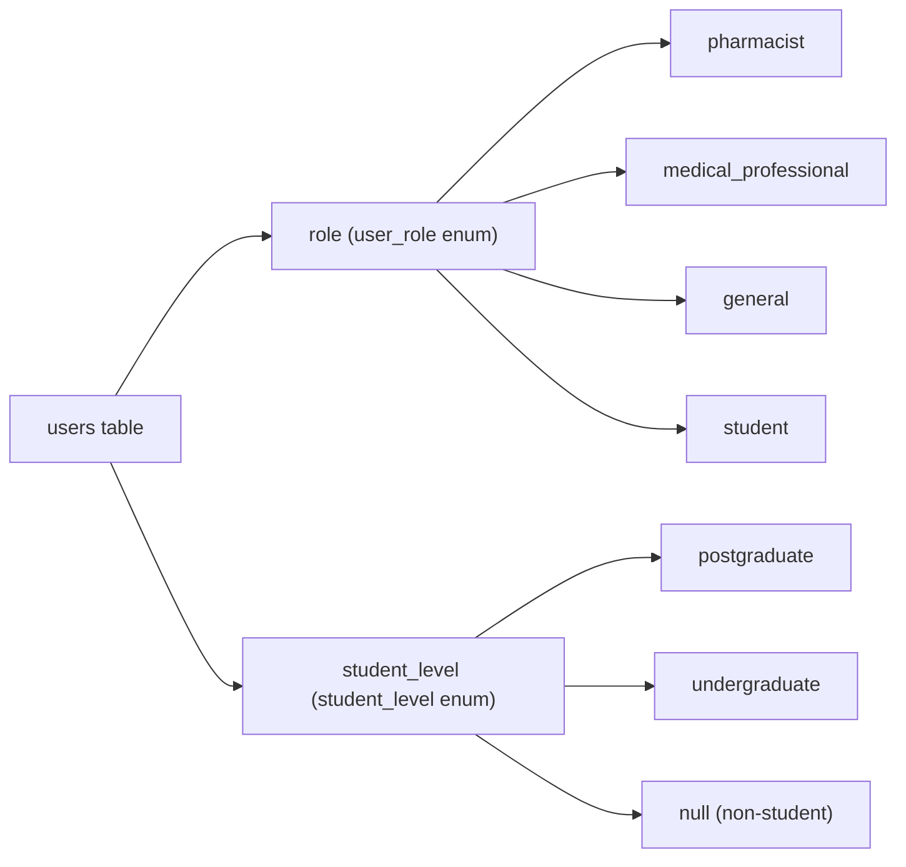
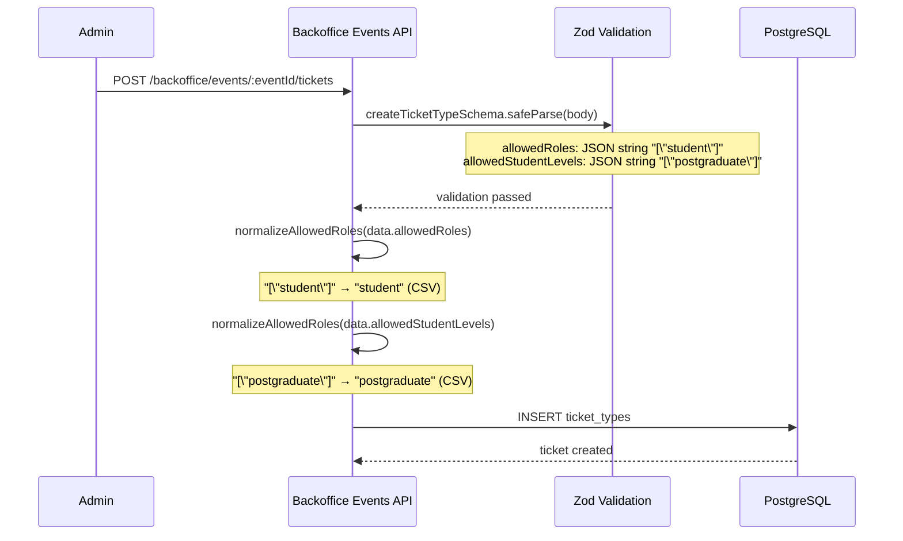
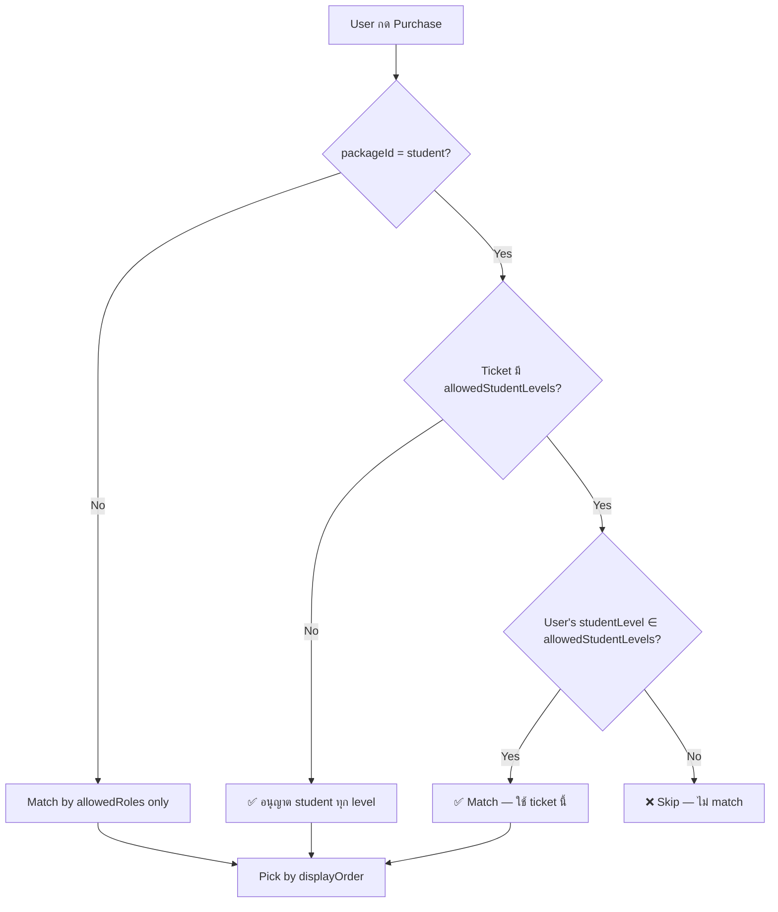
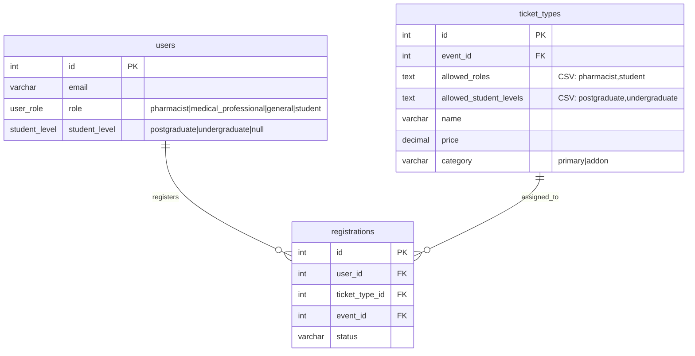

# 📊 วิเคราะห์ระบบ Ticket — การแยก Role และ Student Level

> **ระบบ:** conference-api  
> **วันที่วิเคราะห์:** 2026-05-11  
> **Scope:** Database schema, Zod validation, API routes (backoffice + public + payments + free registration)

---

## 1. สรุปผลลัพธ์ (Executive Summary)

| คำถาม | คำตอบ |
|-------|-------|
| Ticket สามารถแยก Role ได้หรือไม่? | ✅ **ได้** — ผ่านคอลัมน์ `allowed_roles` ใน `ticket_types` |
| Ticket สามารถแยก Student Level ได้หรือไม่? | ✅ **ได้** — ผ่านคอลัมน์ `allowed_student_levels` ใน `ticket_types` |
| ใช้งานจริงแล้วหรือยัง? | ⚠️ **บางส่วน** — มีการ enforce ใน Payment flow, Free Registration flow, และ Public ticket listing ดึงข้อมูลส่งไปแล้ว แต่ยังมี gap บางจุดดังที่ระบุด้านล่าง |

---

## 2. Database Schema

### 2.1 User Roles & Student Levels



#### [users](file:///c:/Users/Nattakarn/Desktop/confer/conference-api/src/database/schema.ts#L98-L119) — คอลัมน์ที่เกี่ยวข้อง

| Column | Type | Description |
|--------|------|-------------|
| `role` | `user_role` enum | `pharmacist`, `medical_professional`, `general`, `student` |
| `student_level` | `student_level` enum (nullable) | `postgraduate`, `undergraduate`, หรือ `null` (สำหรับ non-student) |

### 2.2 Ticket Types — Role & Student Level Restrictions

#### [ticket_types](file:///c:/Users/Nattakarn/Desktop/confer/conference-api/src/database/schema.ts#L269-L294) — คอลัมน์ที่เกี่ยวข้อง

| Column | Type | Description | ตัวอย่างค่า |
|--------|------|-------------|------------|
| `allowed_roles` | `text` (nullable) | CSV ของ role ที่อนุญาต | `"student"`, `"pharmacist,medical_professional"`, `null` (= all roles) |
| `allowed_student_levels` | `text` (nullable) | CSV ของ student level ที่อนุญาต | `"postgraduate"`, `"postgraduate,undergraduate"`, `null` (= all levels) |

> [!IMPORTANT]
> ทั้งสองคอลัมน์เป็น `text` (ไม่ใช่ `jsonb`) — เก็บข้อมูลเป็น **CSV** (เช่น `"pharmacist,student"`) หลังผ่าน normalization จาก JSON array

---

## 3. Data Flow: จากการสร้าง Ticket ถึงการตรวจสอบ Role

### 3.1 การสร้าง/แก้ไข Ticket (Backoffice)



#### Zod Validation ([events.schema.ts](file:///c:/Users/Nattakarn/Desktop/confer/conference-api/src/schemas/events.schema.ts#L66-L113))

- **`allowedRoles`**: ต้องเป็น JSON array string ของ valid roles: `pharmacist`, `medical_professional`, `student`, `general`
- **`allowedStudentLevels`**: ต้องเป็น JSON array string ของ valid levels: `postgraduate`, `undergraduate`

#### Normalization Function ([events.ts:L38-49](file:///c:/Users/Nattakarn/Desktop/confer/conference-api/src/routes/backoffice/events.ts#L38-L49))

```typescript
function normalizeAllowedRoles(raw: string | undefined | null): string | undefined {
  if (!raw) return undefined;
  if (raw.startsWith("[")) {
    try {
      const arr = JSON.parse(raw);
      if (Array.isArray(arr)) return arr.join(","); // "[\"student\"]" → "student"
    } catch { }
  }
  return raw;
}
```

> [!NOTE]
> ฟังก์ชันเดียวกัน `normalizeAllowedRoles` ถูกใช้กับทั้ง `allowedRoles` และ `allowedStudentLevels`

---

### 3.2 Public Ticket Listing — การ Filter ตาม Role

#### [public/tickets.ts](file:///c:/Users/Nattakarn/Desktop/confer/conference-api/src/routes/public/tickets.ts#L54-L213)

เมื่อ frontend ส่ง query `?role=student`:

```typescript
// Filter by role if provided
if (role) {
    conditions.push(
        or(
            isNull(ticketTypes.allowedRoles),     // null = ใช้ได้ทุก role
            eq(ticketTypes.allowedRoles, role),    // exact match "student"
            sql`LIKE ${role + ',%'}`,              // starts with "student,"
            sql`LIKE ${'%,' + role + ',%'}`,       // middle ",student,"
            sql`LIKE ${'%,' + role}`,              // ends with ",student"
            sql`LIKE ${`%"${role}"%`}`             // JSON format
        )
    );
}
```

> [!WARNING]
> **Gap พบ:** Public ticket listing **ไม่ filter ตาม `allowedStudentLevels`** ในฝั่ง SQL query
> 
> Response ส่ง `allowedStudentLevels` กลับให้ frontend แต่ไม่ได้ filter ที่ server-side
> ดังนั้น frontend ต้องรับหน้าที่ filter เอง (หรือแสดงทั้งหมดแล้วให้ user เลือก)

---

### 3.3 Payment Flow — การ Resolve Ticket ตาม Role + Student Level

#### [payments/index.ts](file:///c:/Users/Nattakarn/Desktop/confer/conference-api/src/routes/payments/index.ts#L360-L446) — `resolveTicketId()`

นี่คือ **จุดที่มีการ enforce Student Level อย่างเต็มรูปแบบ:**

```typescript
async function resolveTicketId(
  packageId: string,       // e.g. "student", "pharmacist"
  eventId: number,
  currency: string,
  category: "primary" | "addon",
  studentLevel?: string    // e.g. "postgraduate", "undergraduate"
): Promise<ResolvedTicket | null> {

  // Step 1: ดึง tickets ตาม eventId + currency + category
  // Step 2: Filter active (isActive, saleStartDate, saleEndDate)
  
  // Step 3: Match by role
  const matched = active.filter((t) => {
    const roleMatches = roles.some((r) => t.allowedRoles!.includes(r));
    if (!roleMatches) return false;

    // Step 4: สำหรับ student → ตรวจสอบ studentLevel ด้วย
    if (packageId === "student" && t.allowedStudentLevels && studentLevel) {
      return t.allowedStudentLevels.includes(studentLevel);
    }
    // ถ้าไม่ได้กำหนด allowedStudentLevels → อนุญาตทุก level
    return true;
  });

  // Step 5: เลือก ticket ที่มี displayOrder ต่ำสุด
}
```



---

### 3.4 Free Registration Flow — การ Resolve Ticket ตาม Role + Student Level

#### [registrations/free.ts](file:///c:/Users/Nattakarn/Desktop/confer/conference-api/src/routes/registrations/free.ts#L31-L103) — `resolveFreeTicket()`

Logic **เหมือนกัน** กับ `resolveTicketId()` ใน payment flow:

```typescript
// ดึง user's studentLevel จาก DB
const [userData] = await db
  .select({ studentLevel: users.studentLevel })
  .from(users)
  .where(eq(users.id, userId))
  .limit(1);

const ticket = await resolveFreeTicket(packageId, eventId, userStudentLevel);
```

Student level ถูก enforce ที่ step matching:
```typescript
if (packageId === "student" && t.allowedStudentLevels && studentLevel) {
  return t.allowedStudentLevels.includes(studentLevel);
}
```

---

### 3.5 Backoffice Ticket Listing — การ Filter ตาม Role

#### [backoffice/tickets.ts](file:///c:/Users/Nattakarn/Desktop/confer/conference-api/src/routes/backoffice/tickets.ts#L65-L73)

Backoffice ก็สามารถ filter ตาม role ได้ผ่าน query parameter `?role=student`:

```typescript
if (role) conditions.push(
    or(
        eq(ticketTypes.allowedRoles, role),
        sql`LIKE ${role + ',%'}`,
        sql`LIKE ${'%,' + role + ',%'}`,
        sql`LIKE ${'%,' + role}`,
        sql`LIKE ${`%"${role}"%`}`
    )
);
```

> [!NOTE]
> Backoffice listing ส่ง `allowedStudentLevels` กลับมาใน response แต่ไม่มี query parameter สำหรับ filter ตาม student level

---

## 4. User Registration → Role + Student Level Mapping

#### [auth/register.ts](file:///c:/Users/Nattakarn/Desktop/confer/conference-api/src/routes/auth/register.ts#L14-L28)

เมื่อ user สมัครบัญชี จะมี mapping จาก `accountType` ไปเป็น `role` + `studentLevel`:

| Frontend `accountType` | DB `role` | DB `student_level` |
|------------------------|-----------|-------------------|
| `pharmacist` | `pharmacist` | `null` |
| `medicalProfessional` | `medical_professional` | `null` |
| `generalPublic` | `general` | `null` |
| `postgraduateStudent` | `student` | `postgraduate` |
| `undergraduateStudent` | `student` | `undergraduate` |

> ✅ Student level ถูกเก็บไว้ตั้งแต่ตอน signup และถูกใช้ตอน purchase/free-registration

---

## 5. ตัวอย่างสถานการณ์จริง

### Scenario 1: แยก ticket ตาม role

สร้าง ticket 4 ใบสำหรับ event เดียว:

| Ticket Name | allowedRoles | Price |
|-------------|-------------|-------|
| Pharmacist Early Bird | `pharmacist` | 3,500 THB |
| Student Early Bird | `student` | 1,500 THB |
| Medical Professional Early Bird | `medical_professional` | 3,500 THB |
| General Early Bird | `general` | 4,000 THB |

**ผลลัพธ์:** แต่ละ role จะเห็นเฉพาะ ticket ที่ตรงกับ role ของตัวเอง (ผ่าน `?role=...` query)

### Scenario 2: แยก ticket ตาม student level

สร้าง ticket 2 ใบสำหรับ student:

| Ticket Name | allowedRoles | allowedStudentLevels | Price |
|-------------|-------------|---------------------|-------|
| Postgraduate Student | `student` | `postgraduate` | 2,000 THB |
| Undergraduate Student | `student` | `undergraduate` | 1,000 THB |

**ผลลัพธ์:**
- User ที่เป็น `student` + `postgraduate` → ซื้อได้เฉพาะ ticket ราคา 2,000
- User ที่เป็น `student` + `undergraduate` → ซื้อได้เฉพาะ ticket ราคา 1,000

### Scenario 3: Student ticket ไม่จำกัด level

| Ticket Name | allowedRoles | allowedStudentLevels | Price |
|-------------|-------------|---------------------|-------|
| Student (All Levels) | `student` | `null` (ไม่กำหนด) | 1,500 THB |

**ผลลัพธ์:** Student ทั้ง postgraduate และ undergraduate ซื้อได้

---

## 6. สรุปความสามารถปัจจุบัน

### ✅ ทำได้แล้ว

| Feature | สถานะ | อยู่ที่ไหน |
|---------|--------|-----------|
| สร้าง ticket กำหนด `allowedRoles` | ✅ | Backoffice API |
| สร้าง ticket กำหนด `allowedStudentLevels` | ✅ | Backoffice API |
| Validate roles/student levels ตอนสร้าง ticket | ✅ | Zod schema |
| Normalize ค่าก่อนเก็บ DB (JSON → CSV) | ✅ | `normalizeAllowedRoles()` |
| Public listing filter ตาม role | ✅ | `?role=student` query |
| Payment resolve ตาม role + student level | ✅ | `resolveTicketId()` |
| Free registration resolve ตาม role + student level | ✅ | `resolveFreeTicket()` |
| User มี `studentLevel` ตั้งแต่ signup | ✅ | Auth register route |

### ⚠️ ข้อจำกัด/Gaps

| Gap | รายละเอียด | ผลกระทบ |
|-----|-----------|---------|
| Public listing ไม่ filter `allowedStudentLevels` ที่ server-side | Frontend อาจเห็น ticket ที่ไม่ตรง level (แต่ซื้อไม่ได้เพราะ payment ตรวจสอบ) | Low — เป็น UI issue เท่านั้น |
| Backoffice listing ไม่มี filter `studentLevel` | Admin ไม่สามารถ filter tickets ตาม student level | Low |
| `allowedRoles` เก็บเป็น text/CSV | ไม่สามารถใช้ array operators ของ PostgreSQL ได้ ต้องใช้ LIKE pattern matching | Medium — อาจมี edge case matching ผิด |
| Public listing ไม่รับ `studentLevel` query param | ไม่สามารถ pre-filter ticket ตาม student level จาก URL ได้ | Low — frontend สามารถ filter เองได้ |

---

## 7. แนวทางปรับปรุง (Recommendations)

### 7.1 เพิ่ม Server-side Student Level Filtering (Public Tickets)

เพิ่ม query parameter `studentLevel` ใน public ticket route:

```typescript
// routes/public/tickets.ts
const { role, studentLevel } = request.query as TicketQuery;

// หลัง filter ตาม role แล้ว filter ตาม studentLevel อีกชั้น
if (studentLevel) {
    conditions.push(
        or(
            isNull(ticketTypes.allowedStudentLevels),
            sql`${ticketTypes.allowedStudentLevels} LIKE ${`%${studentLevel}%`}`,
        )
    );
}
```

### 7.2 เปลี่ยนเป็น JSONB Array (Long-term)

เปลี่ยน `allowed_roles` และ `allowed_student_levels` จาก `text` เป็น `jsonb` array:

```typescript
// schema.ts
allowedRoles: jsonb("allowed_roles").$type<string[]>().default([]),
allowedStudentLevels: jsonb("allowed_student_levels").$type<string[]>().default([]),
```

ข้อดี:
- ใช้ PostgreSQL array operators ได้ (`@>`, `?|`)
- ไม่ต้องใช้ LIKE pattern matching
- Type-safe มากขึ้น

### 7.3 เพิ่ม Filter ใน Backoffice Ticket Query

```typescript
// routes/backoffice/tickets.ts
const ticketQuerySchema = z.object({
    // ... existing
    studentLevel: z.enum(['postgraduate', 'undergraduate']).optional(), // NEW
});
```

---

## 8. ER Diagram — ความสัมพันธ์ระหว่าง User, Ticket, Role



---

## 9. สรุปท้าย

> **ระบบ ticket ในปัจจุบันสามารถแยกทั้ง role และ student level ได้อย่างครบถ้วนในส่วนที่สำคัญที่สุดคือ payment/purchase flow** 
> 
> การ enforce ที่สำคัญเกิดขึ้นที่:
> 1. **Payment** (`resolveTicketId`) — ✅ enforce ทั้ง role + studentLevel
> 2. **Free Registration** (`resolveFreeTicket`) — ✅ enforce ทั้ง role + studentLevel  
> 3. **Public Listing** — ✅ filter role, ⚠️ ไม่ filter studentLevel (แค่ส่งข้อมูลไปให้ frontend)
>
> User ไม่สามารถซื้อ ticket ที่ไม่ตรงกับ role/studentLevel ของตัวเอง เนื่องจาก `resolveTicketId` จะ return `null` ทำให้ purchase ล้มเหลว
